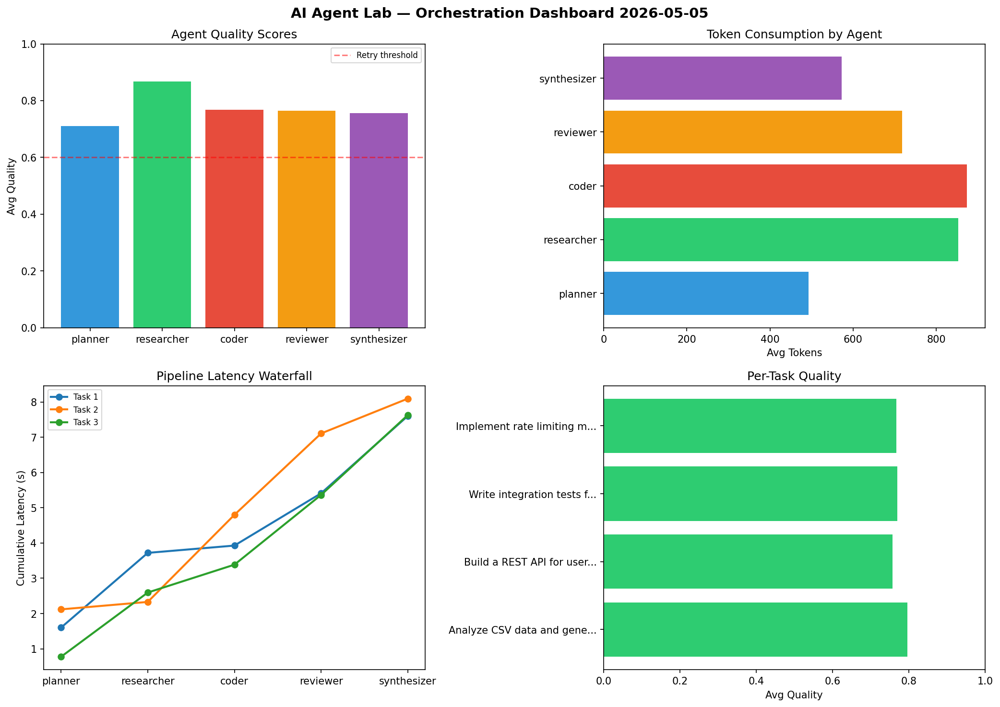

# AI Agent Lab — Orchestration Report 2026-05-05

**Run ID:** `a79226373c` | **Tasks:** 4 | **Avg Quality:** 0.773

## Aggregate Metrics

| Metric | Value |
|--------|-------|
| avg_latency | 7.098 |
| total_tokens | 14035 |
| avg_quality | 0.773 |

## Delta vs Yesterday

| Metric | Today | Yesterday | Change |
|--------|-------|-----------|--------|
| avg_latency | 7.098 | 6.721 | 📈 5.6% |
| total_tokens | 14035 | 17474 | 📉 -19.7% |
| avg_quality | 0.773 | 0.744 | 📈 3.9% |

## Pipeline Results

### Analyze CSV data and generate statistical summary
| Agent | Quality | Latency | Tokens | Status |
|-------|---------|---------|--------|--------|
| planner | 0.89 | 1.602s | 459 | success |
| researcher | 0.925 | 2.119s | 704 | success |
| coder | 0.639 | 0.207s | 885 | success |
| reviewer | 0.844 | 1.483s | 615 | success |
| synthesizer | 0.687 | 2.193s | 610 | success |

### Build a REST API for user authentication
| Agent | Quality | Latency | Tokens | Status |
|-------|---------|---------|--------|--------|
| planner | 0.672 | 2.119s | 480 | success |
| researcher | 0.745 | 0.211s | 839 | success |
| coder | 0.953 | 2.47s | 1102 | success |
| reviewer | 0.774 | 2.308s | 783 | success |
| synthesizer | 0.648 | 0.987s | 510 | success |

### Write integration tests for payment processing module
| Agent | Quality | Latency | Tokens | Status |
|-------|---------|---------|--------|--------|
| planner | 0.705 | 0.775s | 528 | success |
| researcher | 0.896 | 1.821s | 921 | success |
| coder | 0.681 | 0.79s | 849 | success |
| reviewer | 0.753 | 1.979s | 835 | success |
| synthesizer | 0.816 | 2.263s | 411 | success |

### Implement rate limiting middleware
| Agent | Quality | Latency | Tokens | Status |
|-------|---------|---------|--------|--------|
| planner | 0.574 | 1.971s | 503 | needs_retry |
| researcher | 0.903 | 0.876s | 946 | success |
| coder | 0.798 | 0.311s | 658 | success |
| reviewer | 0.687 | 1.189s | 639 | success |
| synthesizer | 0.875 | 0.719s | 758 | success |
