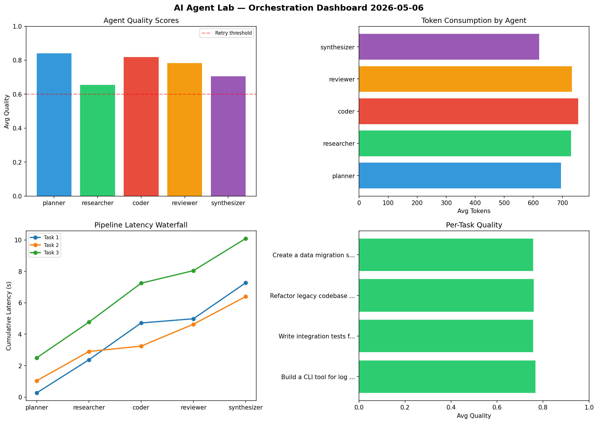

# AI Agent Lab — Orchestration Report 2026-05-06

**Run ID:** `5302b5dc56` | **Tasks:** 4 | **Avg Quality:** 0.76

## Aggregate Metrics

| Metric | Value |
|--------|-------|
| avg_latency | 7.423 |
| total_tokens | 14133 |
| avg_quality | 0.76 |

## Delta vs Yesterday

| Metric | Today | Yesterday | Change |
|--------|-------|-----------|--------|
| avg_latency | 7.423 | 6.047 | 📈 22.8% |
| total_tokens | 14133 | 14821 | 📉 -4.6% |
| avg_quality | 0.76 | 0.759 | 📈 0.1% |

## Pipeline Results

### Build a CLI tool for log analysis
| Agent | Quality | Latency | Tokens | Status |
|-------|---------|---------|--------|--------|
| planner | 0.927 | 0.266s | 965 | success |
| researcher | 0.56 | 2.108s | 493 | needs_retry |
| coder | 0.839 | 2.343s | 808 | success |
| reviewer | 0.567 | 0.267s | 1104 | needs_retry |
| synthesizer | 0.943 | 2.288s | 694 | success |

### Write integration tests for payment processing module
| Agent | Quality | Latency | Tokens | Status |
|-------|---------|---------|--------|--------|
| planner | 0.774 | 1.038s | 657 | success |
| researcher | 0.693 | 1.864s | 430 | success |
| coder | 0.738 | 0.344s | 832 | success |
| reviewer | 0.961 | 1.39s | 792 | success |
| synthesizer | 0.62 | 1.759s | 639 | success |

### Refactor legacy codebase to use dependency injection
| Agent | Quality | Latency | Tokens | Status |
|-------|---------|---------|--------|--------|
| planner | 0.801 | 2.494s | 361 | success |
| researcher | 0.639 | 2.274s | 1084 | success |
| coder | 0.847 | 2.48s | 920 | success |
| reviewer | 0.882 | 0.796s | 764 | success |
| synthesizer | 0.632 | 2.045s | 638 | success |

### Create a data migration script for schema v2
| Agent | Quality | Latency | Tokens | Status |
|-------|---------|---------|--------|--------|
| planner | 0.861 | 0.823s | 798 | success |
| researcher | 0.727 | 1.684s | 914 | success |
| coder | 0.848 | 0.352s | 457 | success |
| reviewer | 0.719 | 1.52s | 271 | success |
| synthesizer | 0.629 | 1.558s | 512 | success |
