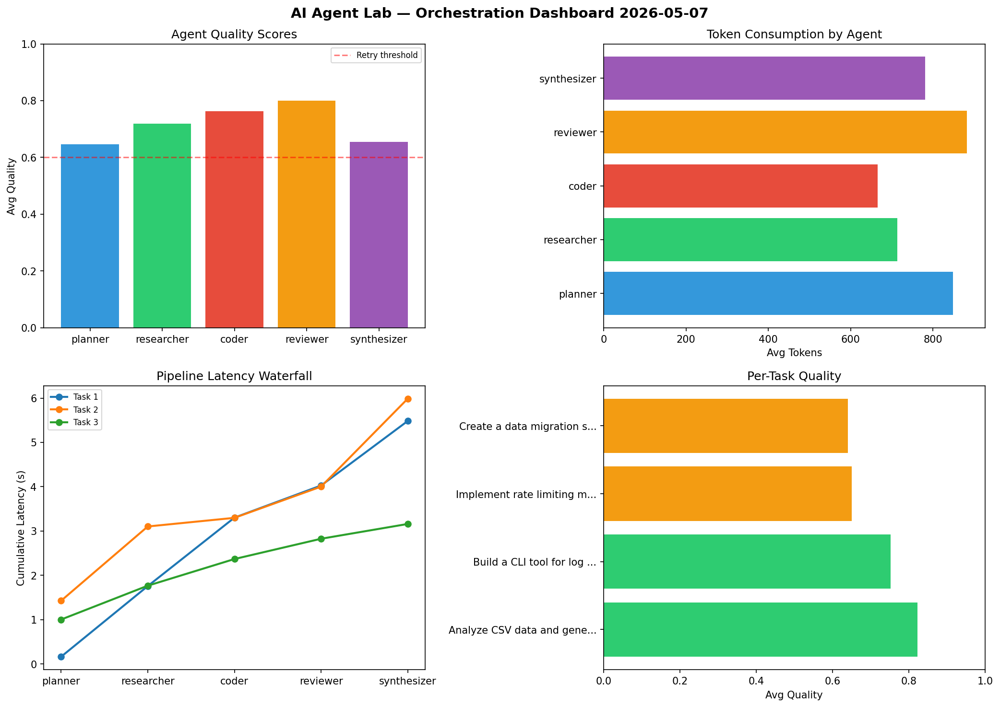

# AI Agent Lab — Orchestration Report 2026-05-07

**Run ID:** `e5994ea251` | **Tasks:** 4 | **Avg Quality:** 0.717

## Aggregate Metrics

| Metric | Value |
|--------|-------|
| avg_latency | 5.106 |
| total_tokens | 15570 |
| avg_quality | 0.717 |

## Delta vs Yesterday

| Metric | Today | Yesterday | Change |
|--------|-------|-----------|--------|
| avg_latency | 5.106 | 5.609 | 📉 -9.0% |
| total_tokens | 15570 | 16782 | 📉 -7.2% |
| avg_quality | 0.717 | 0.757 | 📉 -5.3% |

## Pipeline Results

### Analyze CSV data and generate statistical summary
| Agent | Quality | Latency | Tokens | Status |
|-------|---------|---------|--------|--------|
| planner | 0.656 | 0.161s | 802 | success |
| researcher | 0.974 | 1.595s | 780 | success |
| coder | 0.971 | 1.545s | 435 | success |
| reviewer | 0.994 | 0.726s | 763 | success |
| synthesizer | 0.518 | 1.457s | 460 | needs_retry |

### Build a CLI tool for log analysis
| Agent | Quality | Latency | Tokens | Status |
|-------|---------|---------|--------|--------|
| planner | 0.541 | 1.425s | 970 | needs_retry |
| researcher | 0.557 | 1.677s | 961 | needs_retry |
| coder | 0.95 | 0.195s | 1067 | success |
| reviewer | 0.949 | 0.705s | 1079 | success |
| synthesizer | 0.766 | 1.986s | 857 | success |

### Implement rate limiting middleware
| Agent | Quality | Latency | Tokens | Status |
|-------|---------|---------|--------|--------|
| planner | 0.765 | 1.001s | 724 | success |
| researcher | 0.594 | 0.764s | 803 | needs_retry |
| coder | 0.555 | 0.602s | 463 | needs_retry |
| reviewer | 0.74 | 0.458s | 889 | success |
| synthesizer | 0.598 | 0.334s | 662 | needs_retry |

### Create a data migration script for schema v2
| Agent | Quality | Latency | Tokens | Status |
|-------|---------|---------|--------|--------|
| planner | 0.62 | 1.722s | 900 | success |
| researcher | 0.748 | 1.371s | 311 | success |
| coder | 0.577 | 0.696s | 699 | needs_retry |
| reviewer | 0.52 | 0.593s | 798 | needs_retry |
| synthesizer | 0.74 | 1.41s | 1147 | success |
