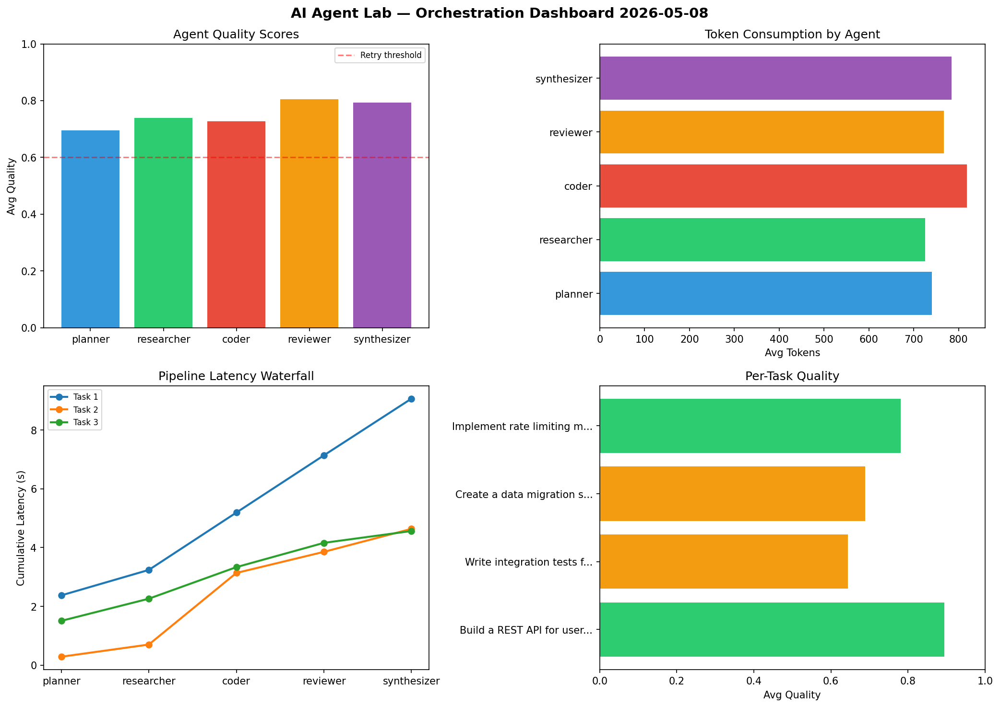

# AI Agent Lab — Orchestration Report 2026-05-08

**Run ID:** `35b7fba578` | **Tasks:** 4 | **Avg Quality:** 0.752

## Aggregate Metrics

| Metric | Value |
|--------|-------|
| avg_latency | 6.217 |
| total_tokens | 15340 |
| avg_quality | 0.752 |

## Delta vs Yesterday

| Metric | Today | Yesterday | Change |
|--------|-------|-----------|--------|
| avg_latency | 6.217 | 7.601 | 📉 -18.2% |
| total_tokens | 15340 | 12388 | 📈 23.8% |
| avg_quality | 0.752 | 0.725 | 📈 3.7% |

## Pipeline Results

### Build a REST API for user authentication
| Agent | Quality | Latency | Tokens | Status |
|-------|---------|---------|--------|--------|
| planner | 0.759 | 2.375s | 609 | success |
| researcher | 0.944 | 0.866s | 727 | success |
| coder | 0.932 | 1.952s | 893 | success |
| reviewer | 0.991 | 1.947s | 529 | success |
| synthesizer | 0.845 | 1.929s | 868 | success |

### Write integration tests for payment processing module
| Agent | Quality | Latency | Tokens | Status |
|-------|---------|---------|--------|--------|
| planner | 0.835 | 0.287s | 634 | success |
| researcher | 0.539 | 0.415s | 975 | needs_retry |
| coder | 0.503 | 2.436s | 776 | needs_retry |
| reviewer | 0.653 | 0.718s | 644 | success |
| synthesizer | 0.689 | 0.782s | 348 | success |

### Create a data migration script for schema v2
| Agent | Quality | Latency | Tokens | Status |
|-------|---------|---------|--------|--------|
| planner | 0.617 | 1.508s | 1206 | success |
| researcher | 0.594 | 0.754s | 619 | needs_retry |
| coder | 0.932 | 1.074s | 843 | success |
| reviewer | 0.614 | 0.826s | 1015 | success |
| synthesizer | 0.686 | 0.403s | 1203 | success |

### Implement rate limiting middleware
| Agent | Quality | Latency | Tokens | Status |
|-------|---------|---------|--------|--------|
| planner | 0.569 | 2.263s | 513 | needs_retry |
| researcher | 0.88 | 1.289s | 579 | success |
| coder | 0.545 | 1.408s | 760 | needs_retry |
| reviewer | 0.96 | 1.077s | 880 | success |
| synthesizer | 0.95 | 0.557s | 719 | success |
