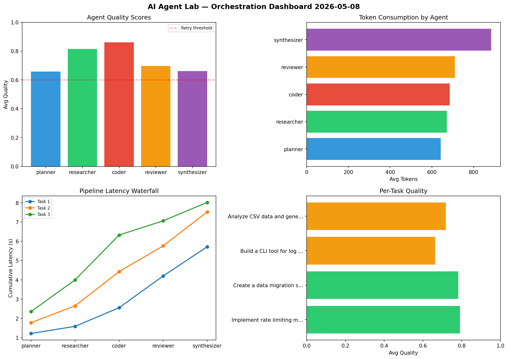

# AI Agent Lab — Orchestration Report 2026-05-08

**Run ID:** `6dc86c5626` | **Tasks:** 4 | **Avg Quality:** 0.684

## Aggregate Metrics

| Metric | Value |
|--------|-------|
| avg_latency | 6.143 |
| total_tokens | 15000 |
| avg_quality | 0.684 |

## Delta vs Yesterday

| Metric | Today | Yesterday | Change |
|--------|-------|-----------|--------|
| avg_latency | 6.143 | 7.601 | 📉 -19.2% |
| total_tokens | 15000 | 12388 | 📈 21.1% |
| avg_quality | 0.684 | 0.725 | 📉 -5.7% |

## Pipeline Results

### Build a CLI tool for log analysis
| Agent | Quality | Latency | Tokens | Status |
|-------|---------|---------|--------|--------|
| planner | 0.754 | 2.308s | 890 | success |
| researcher | 0.511 | 2.451s | 1088 | needs_retry |
| coder | 0.736 | 1.32s | 610 | success |
| reviewer | 0.949 | 2.252s | 1166 | success |
| synthesizer | 0.9 | 0.387s | 606 | success |

### Build a REST API for user authentication
| Agent | Quality | Latency | Tokens | Status |
|-------|---------|---------|--------|--------|
| planner | 0.821 | 0.455s | 905 | success |
| researcher | 0.571 | 0.587s | 401 | needs_retry |
| coder | 0.774 | 0.125s | 377 | success |
| reviewer | 0.528 | 0.28s | 446 | needs_retry |
| synthesizer | 0.566 | 0.786s | 791 | needs_retry |

### Write integration tests for payment processing module
| Agent | Quality | Latency | Tokens | Status |
|-------|---------|---------|--------|--------|
| planner | 0.521 | 0.545s | 587 | needs_retry |
| researcher | 0.62 | 1.69s | 889 | success |
| coder | 0.557 | 2.486s | 1084 | needs_retry |
| reviewer | 0.835 | 0.115s | 807 | success |
| synthesizer | 0.704 | 0.592s | 890 | success |

### Create a data migration script for schema v2
| Agent | Quality | Latency | Tokens | Status |
|-------|---------|---------|--------|--------|
| planner | 0.589 | 0.208s | 444 | needs_retry |
| researcher | 0.722 | 2.491s | 533 | success |
| coder | 0.72 | 1.983s | 607 | success |
| reviewer | 0.658 | 1.026s | 1074 | success |
| synthesizer | 0.658 | 2.485s | 805 | success |
