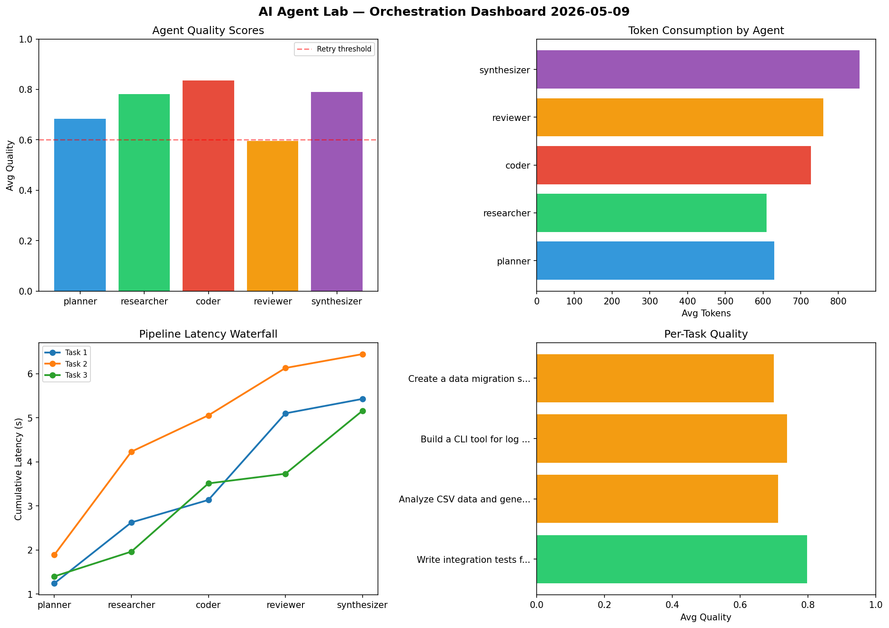

# AI Agent Lab — Orchestration Report 2026-05-09

**Run ID:** `cb700f4580` | **Tasks:** 4 | **Avg Quality:** 0.737

## Aggregate Metrics

| Metric | Value |
|--------|-------|
| avg_latency | 6.413 |
| total_tokens | 14328 |
| avg_quality | 0.737 |

## Delta vs Yesterday

| Metric | Today | Yesterday | Change |
|--------|-------|-----------|--------|
| avg_latency | 6.413 | 7.383 | 📉 -13.1% |
| total_tokens | 14328 | 14376 | 📉 -0.3% |
| avg_quality | 0.737 | 0.739 | 📉 -0.3% |

## Pipeline Results

### Write integration tests for payment processing module
| Agent | Quality | Latency | Tokens | Status |
|-------|---------|---------|--------|--------|
| planner | 0.859 | 1.243s | 826 | success |
| researcher | 0.973 | 1.382s | 734 | success |
| coder | 0.81 | 0.51s | 640 | success |
| reviewer | 0.624 | 1.964s | 453 | success |
| synthesizer | 0.722 | 0.328s | 800 | success |

### Analyze CSV data and generate statistical summary
| Agent | Quality | Latency | Tokens | Status |
|-------|---------|---------|--------|--------|
| planner | 0.783 | 1.888s | 629 | success |
| researcher | 0.842 | 2.342s | 377 | success |
| coder | 0.648 | 0.824s | 1023 | success |
| reviewer | 0.506 | 1.074s | 504 | needs_retry |
| synthesizer | 0.783 | 0.315s | 1030 | success |

### Build a CLI tool for log analysis
| Agent | Quality | Latency | Tokens | Status |
|-------|---------|---------|--------|--------|
| planner | 0.546 | 1.401s | 553 | needs_retry |
| researcher | 0.761 | 0.562s | 484 | success |
| coder | 0.906 | 1.547s | 661 | success |
| reviewer | 0.625 | 0.22s | 989 | success |
| synthesizer | 0.853 | 1.429s | 441 | success |

### Create a data migration script for schema v2
| Agent | Quality | Latency | Tokens | Status |
|-------|---------|---------|--------|--------|
| planner | 0.545 | 2.18s | 511 | needs_retry |
| researcher | 0.549 | 0.422s | 843 | needs_retry |
| coder | 0.978 | 1.557s | 585 | success |
| reviewer | 0.625 | 2.357s | 1092 | success |
| synthesizer | 0.798 | 2.108s | 1153 | success |
