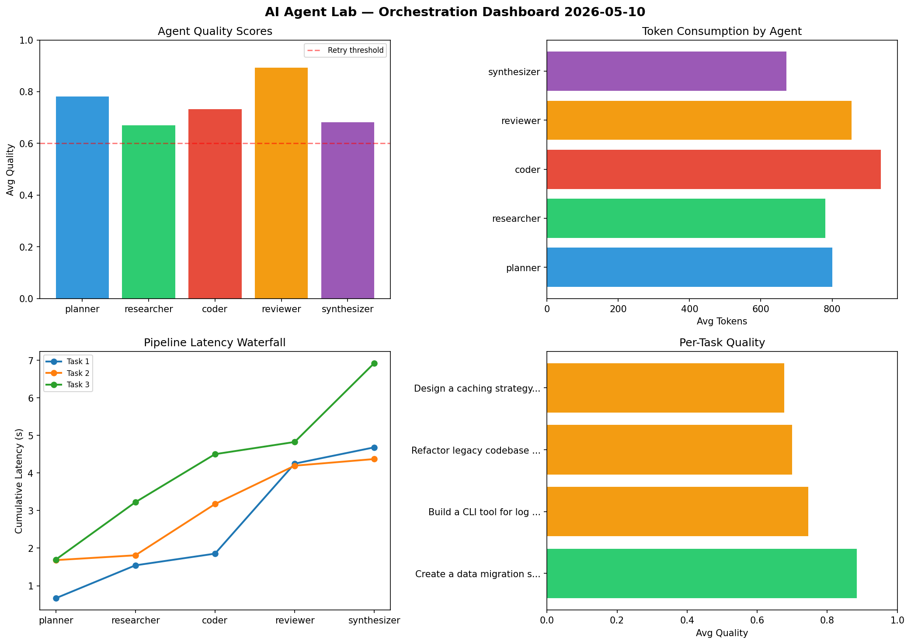

# AI Agent Lab — Orchestration Report 2026-05-10

**Run ID:** `7e92e1f5a9` | **Tasks:** 4 | **Avg Quality:** 0.752

## Aggregate Metrics

| Metric | Value |
|--------|-------|
| avg_latency | 5.278 |
| total_tokens | 16170 |
| avg_quality | 0.752 |

## Delta vs Yesterday

| Metric | Today | Yesterday | Change |
|--------|-------|-----------|--------|
| avg_latency | 5.278 | 7.38 | 📉 -28.5% |
| total_tokens | 16170 | 14373 | 📈 12.5% |
| avg_quality | 0.752 | 0.764 | 📉 -1.6% |

## Pipeline Results

### Create a data migration script for schema v2
| Agent | Quality | Latency | Tokens | Status |
|-------|---------|---------|--------|--------|
| planner | 0.982 | 0.668s | 980 | success |
| researcher | 0.9 | 0.875s | 942 | success |
| coder | 0.985 | 0.311s | 1064 | success |
| reviewer | 0.923 | 2.395s | 873 | success |
| synthesizer | 0.629 | 0.433s | 408 | success |

### Build a CLI tool for log analysis
| Agent | Quality | Latency | Tokens | Status |
|-------|---------|---------|--------|--------|
| planner | 0.694 | 1.682s | 623 | success |
| researcher | 0.63 | 0.128s | 501 | success |
| coder | 0.722 | 1.364s | 997 | success |
| reviewer | 0.985 | 1.02s | 665 | success |
| synthesizer | 0.698 | 0.177s | 638 | success |

### Refactor legacy codebase to use dependency injection
| Agent | Quality | Latency | Tokens | Status |
|-------|---------|---------|--------|--------|
| planner | 0.815 | 1.696s | 822 | success |
| researcher | 0.555 | 1.527s | 633 | needs_retry |
| coder | 0.554 | 1.278s | 1113 | needs_retry |
| reviewer | 0.99 | 0.324s | 1067 | success |
| synthesizer | 0.588 | 2.098s | 1097 | needs_retry |

### Design a caching strategy for high-traffic endpoints
| Agent | Quality | Latency | Tokens | Status |
|-------|---------|---------|--------|--------|
| planner | 0.633 | 0.378s | 776 | success |
| researcher | 0.597 | 2.187s | 1047 | needs_retry |
| coder | 0.672 | 0.972s | 571 | success |
| reviewer | 0.671 | 1.181s | 811 | success |
| synthesizer | 0.811 | 0.417s | 542 | success |
