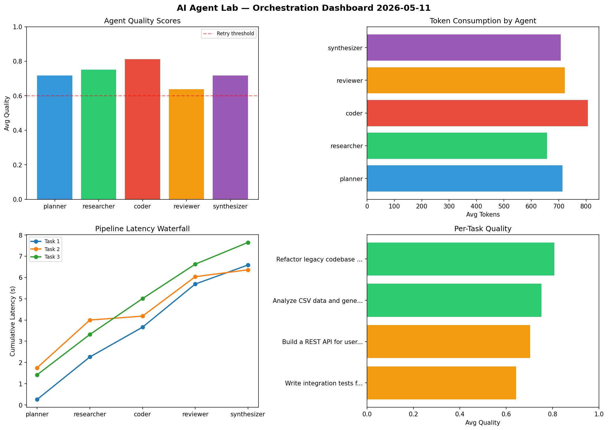

# AI Agent Lab — Orchestration Report 2026-05-11

**Run ID:** `4bbad8bf37` | **Tasks:** 4 | **Avg Quality:** 0.726

## Aggregate Metrics

| Metric | Value |
|--------|-------|
| avg_latency | 7.153 |
| total_tokens | 14433 |
| avg_quality | 0.726 |

## Delta vs Yesterday

| Metric | Today | Yesterday | Change |
|--------|-------|-----------|--------|
| avg_latency | 7.153 | 6.661 | 📈 7.4% |
| total_tokens | 14433 | 14010 | 📈 3.0% |
| avg_quality | 0.726 | 0.662 | 📈 9.7% |

## Pipeline Results

### Write integration tests for payment processing module
| Agent | Quality | Latency | Tokens | Status |
|-------|---------|---------|--------|--------|
| planner | 0.5 | 0.26s | 727 | needs_retry |
| researcher | 0.566 | 1.999s | 723 | needs_retry |
| coder | 0.634 | 1.402s | 1019 | success |
| reviewer | 0.653 | 2.03s | 475 | success |
| synthesizer | 0.864 | 0.895s | 648 | success |

### Build a REST API for user authentication
| Agent | Quality | Latency | Tokens | Status |
|-------|---------|---------|--------|--------|
| planner | 0.816 | 1.751s | 995 | success |
| researcher | 0.645 | 2.246s | 511 | success |
| coder | 0.812 | 0.184s | 485 | success |
| reviewer | 0.733 | 1.856s | 1096 | success |
| synthesizer | 0.511 | 0.324s | 999 | needs_retry |

### Analyze CSV data and generate statistical summary
| Agent | Quality | Latency | Tokens | Status |
|-------|---------|---------|--------|--------|
| planner | 0.753 | 1.421s | 848 | success |
| researcher | 0.952 | 1.896s | 670 | success |
| coder | 0.81 | 1.689s | 672 | success |
| reviewer | 0.663 | 1.62s | 333 | success |
| synthesizer | 0.584 | 1.023s | 780 | needs_retry |

### Refactor legacy codebase to use dependency injection
| Agent | Quality | Latency | Tokens | Status |
|-------|---------|---------|--------|--------|
| planner | 0.797 | 1.398s | 286 | success |
| researcher | 0.843 | 0.801s | 725 | success |
| coder | 0.989 | 2.439s | 1051 | success |
| reviewer | 0.502 | 1.102s | 985 | needs_retry |
| synthesizer | 0.911 | 2.276s | 405 | success |
