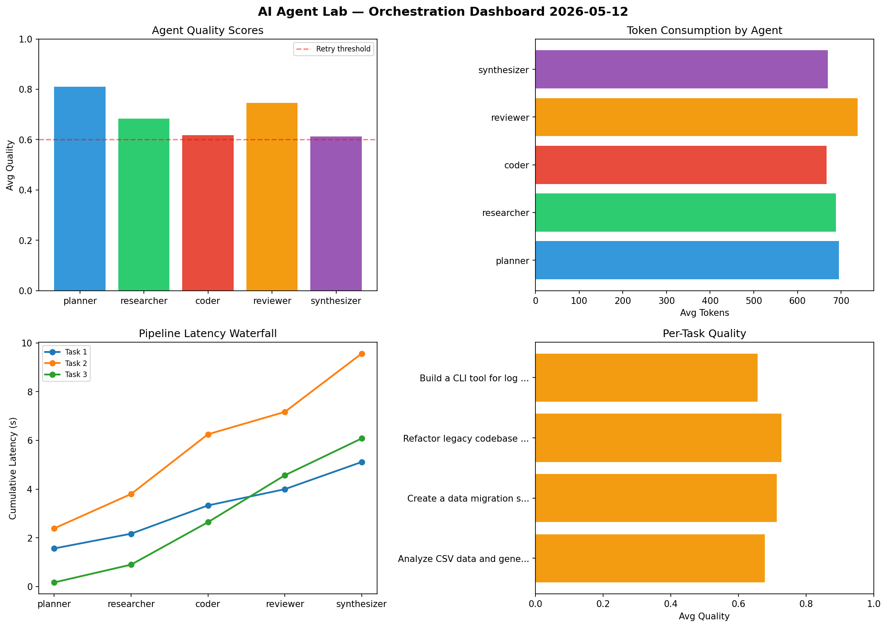

# AI Agent Lab — Orchestration Report 2026-05-12

**Run ID:** `b262ece79f` | **Tasks:** 4 | **Avg Quality:** 0.694

## Aggregate Metrics

| Metric | Value |
|--------|-------|
| avg_latency | 6.405 |
| total_tokens | 13828 |
| avg_quality | 0.694 |

## Delta vs Yesterday

| Metric | Today | Yesterday | Change |
|--------|-------|-----------|--------|
| avg_latency | 6.405 | 6.018 | 📈 6.4% |
| total_tokens | 13828 | 15438 | 📉 -10.4% |
| avg_quality | 0.694 | 0.785 | 📉 -11.6% |

## Pipeline Results

### Analyze CSV data and generate statistical summary
| Agent | Quality | Latency | Tokens | Status |
|-------|---------|---------|--------|--------|
| planner | 0.711 | 1.561s | 833 | success |
| researcher | 0.834 | 0.605s | 609 | success |
| coder | 0.521 | 1.161s | 828 | needs_retry |
| reviewer | 0.629 | 0.668s | 693 | success |
| synthesizer | 0.693 | 1.117s | 874 | success |

### Create a data migration script for schema v2
| Agent | Quality | Latency | Tokens | Status |
|-------|---------|---------|--------|--------|
| planner | 0.829 | 2.385s | 695 | success |
| researcher | 0.619 | 1.411s | 1024 | success |
| coder | 0.601 | 2.455s | 883 | success |
| reviewer | 0.883 | 0.918s | 719 | success |
| synthesizer | 0.636 | 2.398s | 383 | success |

### Refactor legacy codebase to use dependency injection
| Agent | Quality | Latency | Tokens | Status |
|-------|---------|---------|--------|--------|
| planner | 0.898 | 0.165s | 642 | success |
| researcher | 0.638 | 0.73s | 648 | success |
| coder | 0.78 | 1.744s | 444 | success |
| reviewer | 0.707 | 1.927s | 830 | success |
| synthesizer | 0.612 | 1.513s | 874 | success |

### Build a CLI tool for log analysis
| Agent | Quality | Latency | Tokens | Status |
|-------|---------|---------|--------|--------|
| planner | 0.801 | 0.394s | 611 | success |
| researcher | 0.642 | 0.88s | 471 | success |
| coder | 0.566 | 1.502s | 510 | needs_retry |
| reviewer | 0.763 | 1.846s | 709 | success |
| synthesizer | 0.511 | 0.24s | 548 | needs_retry |
