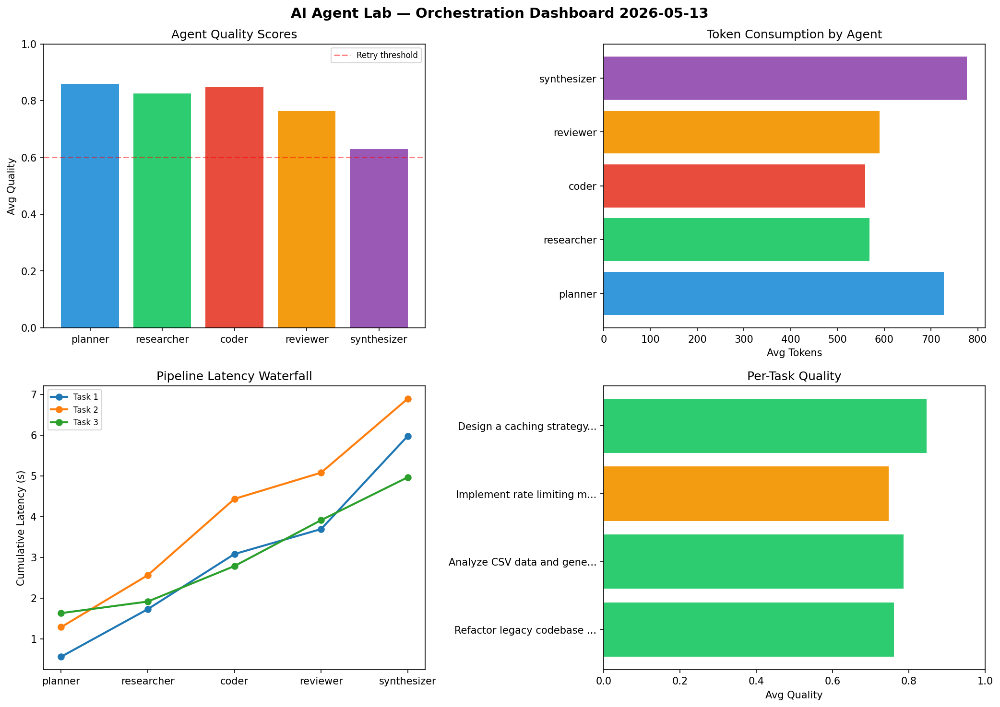

# AI Agent Lab — Orchestration Report 2026-05-13

**Run ID:** `6da6527327` | **Tasks:** 4 | **Avg Quality:** 0.785

## Aggregate Metrics

| Metric | Value |
|--------|-------|
| avg_latency | 6.328 |
| total_tokens | 12889 |
| avg_quality | 0.785 |

## Delta vs Yesterday

| Metric | Today | Yesterday | Change |
|--------|-------|-----------|--------|
| avg_latency | 6.328 | 6.294 | 📈 0.5% |
| total_tokens | 12889 | 15198 | 📉 -15.2% |
| avg_quality | 0.785 | 0.739 | 📈 6.2% |

## Pipeline Results

### Refactor legacy codebase to use dependency injection
| Agent | Quality | Latency | Tokens | Status |
|-------|---------|---------|--------|--------|
| planner | 0.988 | 0.557s | 611 | success |
| researcher | 0.663 | 1.168s | 723 | success |
| coder | 0.967 | 1.353s | 869 | success |
| reviewer | 0.607 | 0.613s | 831 | success |
| synthesizer | 0.58 | 2.286s | 1086 | needs_retry |

### Analyze CSV data and generate statistical summary
| Agent | Quality | Latency | Tokens | Status |
|-------|---------|---------|--------|--------|
| planner | 0.786 | 1.283s | 1192 | success |
| researcher | 0.693 | 1.276s | 244 | success |
| coder | 0.658 | 1.873s | 315 | success |
| reviewer | 0.918 | 0.644s | 346 | success |
| synthesizer | 0.877 | 1.817s | 287 | success |

### Implement rate limiting middleware
| Agent | Quality | Latency | Tokens | Status |
|-------|---------|---------|--------|--------|
| planner | 0.831 | 1.628s | 573 | success |
| researcher | 0.976 | 0.284s | 415 | success |
| coder | 0.827 | 0.871s | 776 | success |
| reviewer | 0.592 | 1.127s | 904 | needs_retry |
| synthesizer | 0.509 | 1.053s | 727 | needs_retry |

### Design a caching strategy for high-traffic endpoints
| Agent | Quality | Latency | Tokens | Status |
|-------|---------|---------|--------|--------|
| planner | 0.828 | 0.352s | 534 | success |
| researcher | 0.971 | 1.148s | 893 | success |
| coder | 0.943 | 1.525s | 278 | success |
| reviewer | 0.939 | 1.967s | 278 | success |
| synthesizer | 0.553 | 2.488s | 1007 | needs_retry |
