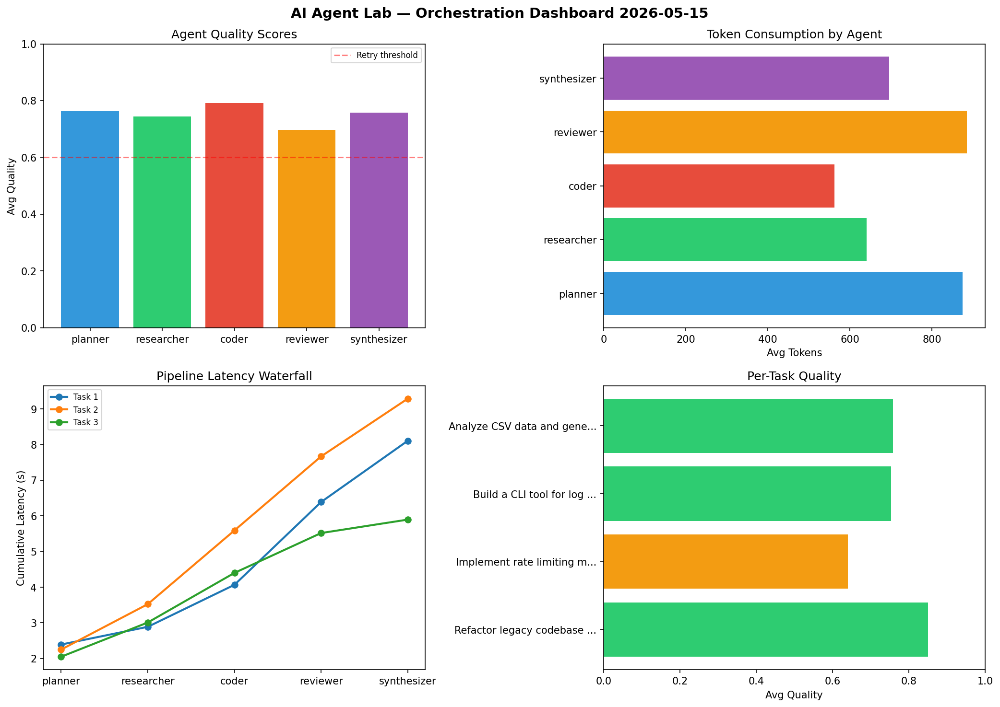

# AI Agent Lab — Orchestration Report 2026-05-15

**Run ID:** `bed58fc169` | **Tasks:** 4 | **Avg Quality:** 0.751

## Aggregate Metrics

| Metric | Value |
|--------|-------|
| avg_latency | 7.526 |
| total_tokens | 14634 |
| avg_quality | 0.751 |

## Delta vs Yesterday

| Metric | Today | Yesterday | Change |
|--------|-------|-----------|--------|
| avg_latency | 7.526 | 6.847 | 📈 9.9% |
| total_tokens | 14634 | 12629 | 📈 15.9% |
| avg_quality | 0.751 | 0.778 | 📉 -3.5% |

## Pipeline Results

### Refactor legacy codebase to use dependency injection
| Agent | Quality | Latency | Tokens | Status |
|-------|---------|---------|--------|--------|
| planner | 0.944 | 2.392s | 545 | success |
| researcher | 0.965 | 0.497s | 690 | success |
| coder | 0.65 | 1.178s | 241 | success |
| reviewer | 0.972 | 2.322s | 1171 | success |
| synthesizer | 0.724 | 1.718s | 911 | success |

### Implement rate limiting middleware
| Agent | Quality | Latency | Tokens | Status |
|-------|---------|---------|--------|--------|
| planner | 0.518 | 2.251s | 1260 | needs_retry |
| researcher | 0.584 | 1.274s | 879 | needs_retry |
| coder | 0.991 | 2.067s | 541 | success |
| reviewer | 0.505 | 2.076s | 769 | needs_retry |
| synthesizer | 0.602 | 1.62s | 791 | success |

### Build a CLI tool for log analysis
| Agent | Quality | Latency | Tokens | Status |
|-------|---------|---------|--------|--------|
| planner | 0.709 | 2.05s | 781 | success |
| researcher | 0.682 | 0.96s | 355 | success |
| coder | 0.772 | 1.391s | 837 | success |
| reviewer | 0.754 | 1.118s | 826 | success |
| synthesizer | 0.851 | 0.377s | 248 | success |

### Analyze CSV data and generate statistical summary
| Agent | Quality | Latency | Tokens | Status |
|-------|---------|---------|--------|--------|
| planner | 0.879 | 0.608s | 914 | success |
| researcher | 0.743 | 0.704s | 638 | success |
| coder | 0.756 | 2.206s | 629 | success |
| reviewer | 0.559 | 2.262s | 775 | needs_retry |
| synthesizer | 0.857 | 1.033s | 833 | success |
