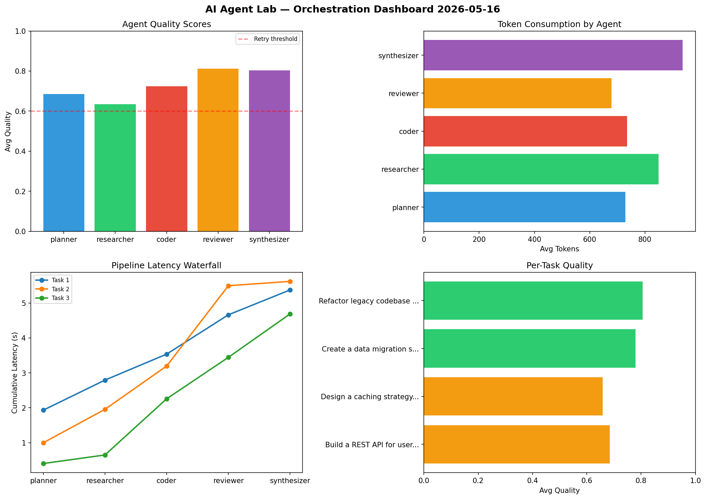

# AI Agent Lab — Orchestration Report 2026-05-16

**Run ID:** `625a73c070` | **Tasks:** 4 | **Avg Quality:** 0.732

## Aggregate Metrics

| Metric | Value |
|--------|-------|
| avg_latency | 4.797 |
| total_tokens | 15712 |
| avg_quality | 0.732 |

## Delta vs Yesterday

| Metric | Today | Yesterday | Change |
|--------|-------|-----------|--------|
| avg_latency | 4.797 | 7.803 | 📉 -38.5% |
| total_tokens | 15712 | 13548 | 📈 16.0% |
| avg_quality | 0.732 | 0.739 | 📉 -0.9% |

## Pipeline Results

### Build a REST API for user authentication
| Agent | Quality | Latency | Tokens | Status |
|-------|---------|---------|--------|--------|
| planner | 0.568 | 1.932s | 1031 | needs_retry |
| researcher | 0.681 | 0.861s | 959 | success |
| coder | 0.55 | 0.744s | 431 | needs_retry |
| reviewer | 0.652 | 1.125s | 840 | success |
| synthesizer | 0.968 | 0.712s | 1088 | success |

### Design a caching strategy for high-traffic endpoints
| Agent | Quality | Latency | Tokens | Status |
|-------|---------|---------|--------|--------|
| planner | 0.603 | 0.999s | 237 | success |
| researcher | 0.506 | 0.957s | 458 | needs_retry |
| coder | 0.84 | 1.24s | 766 | success |
| reviewer | 0.776 | 2.299s | 788 | success |
| synthesizer | 0.567 | 0.125s | 886 | needs_retry |

### Create a data migration script for schema v2
| Agent | Quality | Latency | Tokens | Status |
|-------|---------|---------|--------|--------|
| planner | 0.655 | 0.405s | 1019 | success |
| researcher | 0.786 | 0.245s | 992 | success |
| coder | 0.751 | 1.608s | 932 | success |
| reviewer | 0.876 | 1.186s | 722 | success |
| synthesizer | 0.827 | 1.244s | 676 | success |

### Refactor legacy codebase to use dependency injection
| Agent | Quality | Latency | Tokens | Status |
|-------|---------|---------|--------|--------|
| planner | 0.913 | 0.352s | 627 | success |
| researcher | 0.568 | 0.52s | 990 | needs_retry |
| coder | 0.752 | 0.808s | 814 | success |
| reviewer | 0.945 | 0.716s | 363 | success |
| synthesizer | 0.853 | 1.111s | 1093 | success |
