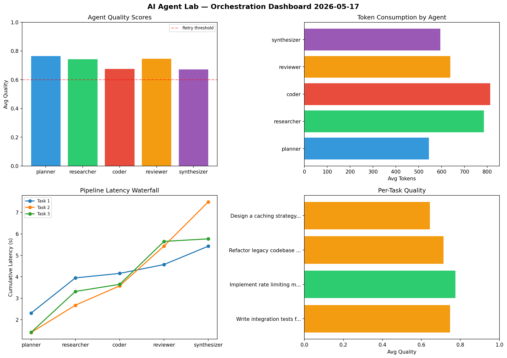

# AI Agent Lab — Orchestration Report 2026-05-17

**Run ID:** `796c903aa7` | **Tasks:** 4 | **Avg Quality:** 0.72

## Aggregate Metrics

| Metric | Value |
|--------|-------|
| avg_latency | 6.213 |
| total_tokens | 13500 |
| avg_quality | 0.72 |

## Delta vs Yesterday

| Metric | Today | Yesterday | Change |
|--------|-------|-----------|--------|
| avg_latency | 6.213 | 7.55 | 📉 -17.7% |
| total_tokens | 13500 | 13900 | 📉 -2.9% |
| avg_quality | 0.72 | 0.716 | 📈 0.6% |

## Pipeline Results

### Write integration tests for payment processing module
| Agent | Quality | Latency | Tokens | Status |
|-------|---------|---------|--------|--------|
| planner | 0.843 | 2.308s | 388 | success |
| researcher | 0.848 | 1.641s | 1099 | success |
| coder | 0.575 | 0.209s | 785 | needs_retry |
| reviewer | 0.85 | 0.413s | 461 | success |
| synthesizer | 0.619 | 0.855s | 311 | success |

### Implement rate limiting middleware
| Agent | Quality | Latency | Tokens | Status |
|-------|---------|---------|--------|--------|
| planner | 0.866 | 1.403s | 1038 | success |
| researcher | 0.672 | 1.273s | 683 | success |
| coder | 0.799 | 0.902s | 545 | success |
| reviewer | 0.825 | 1.854s | 575 | success |
| synthesizer | 0.706 | 2.059s | 350 | success |

### Refactor legacy codebase to use dependency injection
| Agent | Quality | Latency | Tokens | Status |
|-------|---------|---------|--------|--------|
| planner | 0.847 | 1.411s | 391 | success |
| researcher | 0.518 | 1.907s | 547 | needs_retry |
| coder | 0.822 | 0.331s | 966 | success |
| reviewer | 0.702 | 2.0s | 421 | success |
| synthesizer | 0.676 | 0.119s | 1041 | success |

### Design a caching strategy for high-traffic endpoints
| Agent | Quality | Latency | Tokens | Status |
|-------|---------|---------|--------|--------|
| planner | 0.501 | 2.404s | 360 | needs_retry |
| researcher | 0.932 | 0.353s | 813 | success |
| coder | 0.502 | 0.475s | 954 | needs_retry |
| reviewer | 0.604 | 0.501s | 1096 | success |
| synthesizer | 0.683 | 2.433s | 676 | success |
