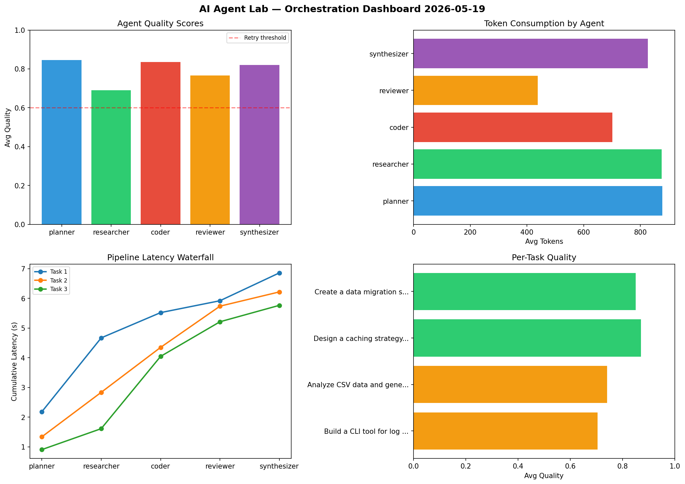

# AI Agent Lab — Orchestration Report 2026-05-19

**Run ID:** `8145263691` | **Tasks:** 4 | **Avg Quality:** 0.792

## Aggregate Metrics

| Metric | Value |
|--------|-------|
| avg_latency | 5.99 |
| total_tokens | 14867 |
| avg_quality | 0.792 |

## Delta vs Yesterday

| Metric | Today | Yesterday | Change |
|--------|-------|-----------|--------|
| avg_latency | 5.99 | 5.668 | 📈 5.7% |
| total_tokens | 14867 | 14579 | 📈 2.0% |
| avg_quality | 0.792 | 0.762 | 📈 3.9% |

## Pipeline Results

### Build a CLI tool for log analysis
| Agent | Quality | Latency | Tokens | Status |
|-------|---------|---------|--------|--------|
| planner | 0.982 | 2.181s | 926 | success |
| researcher | 0.514 | 2.487s | 881 | needs_retry |
| coder | 0.602 | 0.85s | 591 | success |
| reviewer | 0.642 | 0.4s | 245 | success |
| synthesizer | 0.783 | 0.937s | 1011 | success |

### Analyze CSV data and generate statistical summary
| Agent | Quality | Latency | Tokens | Status |
|-------|---------|---------|--------|--------|
| planner | 0.64 | 1.337s | 706 | success |
| researcher | 0.811 | 1.498s | 876 | success |
| coder | 0.953 | 1.512s | 743 | success |
| reviewer | 0.632 | 1.388s | 641 | success |
| synthesizer | 0.67 | 0.48s | 828 | success |

### Design a caching strategy for high-traffic endpoints
| Agent | Quality | Latency | Tokens | Status |
|-------|---------|---------|--------|--------|
| planner | 0.768 | 0.907s | 1049 | success |
| researcher | 0.914 | 0.705s | 887 | success |
| coder | 0.868 | 2.432s | 793 | success |
| reviewer | 0.906 | 1.166s | 283 | success |
| synthesizer | 0.9 | 0.553s | 889 | success |

### Create a data migration script for schema v2
| Agent | Quality | Latency | Tokens | Status |
|-------|---------|---------|--------|--------|
| planner | 0.995 | 1.457s | 828 | success |
| researcher | 0.52 | 1.964s | 854 | needs_retry |
| coder | 0.921 | 0.651s | 678 | success |
| reviewer | 0.888 | 0.121s | 582 | success |
| synthesizer | 0.928 | 0.934s | 576 | success |
