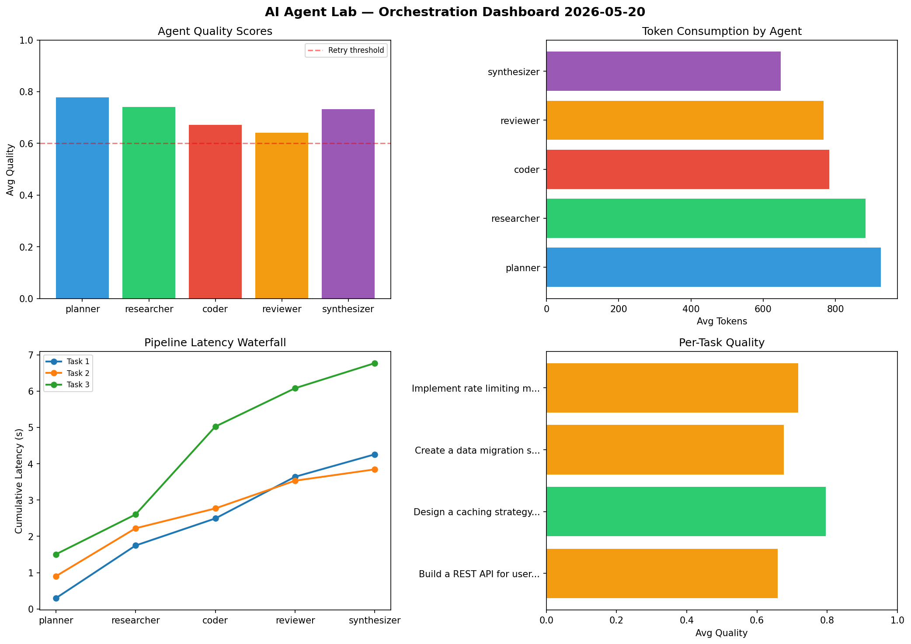

# AI Agent Lab — Orchestration Report 2026-05-20

**Run ID:** `02c8b9f501` | **Tasks:** 4 | **Avg Quality:** 0.712

## Aggregate Metrics

| Metric | Value |
|--------|-------|
| avg_latency | 6.03 |
| total_tokens | 16022 |
| avg_quality | 0.712 |

## Delta vs Yesterday

| Metric | Today | Yesterday | Change |
|--------|-------|-----------|--------|
| avg_latency | 6.03 | 5.99 | 📈 0.7% |
| total_tokens | 16022 | 14867 | 📈 7.8% |
| avg_quality | 0.712 | 0.792 | 📉 -10.1% |

## Pipeline Results

### Build a REST API for user authentication
| Agent | Quality | Latency | Tokens | Status |
|-------|---------|---------|--------|--------|
| planner | 0.862 | 0.295s | 924 | success |
| researcher | 0.564 | 1.452s | 839 | needs_retry |
| coder | 0.543 | 0.745s | 451 | needs_retry |
| reviewer | 0.559 | 1.148s | 666 | needs_retry |
| synthesizer | 0.767 | 0.618s | 706 | success |

### Design a caching strategy for high-traffic endpoints
| Agent | Quality | Latency | Tokens | Status |
|-------|---------|---------|--------|--------|
| planner | 0.8 | 0.9s | 1118 | success |
| researcher | 0.995 | 1.321s | 458 | success |
| coder | 0.617 | 0.547s | 660 | success |
| reviewer | 0.765 | 0.764s | 715 | success |
| synthesizer | 0.803 | 0.312s | 749 | success |

### Create a data migration script for schema v2
| Agent | Quality | Latency | Tokens | Status |
|-------|---------|---------|--------|--------|
| planner | 0.705 | 1.504s | 700 | success |
| researcher | 0.618 | 1.098s | 1014 | success |
| coder | 0.75 | 2.421s | 768 | success |
| reviewer | 0.503 | 1.056s | 898 | needs_retry |
| synthesizer | 0.804 | 0.691s | 623 | success |

### Implement rate limiting middleware
| Agent | Quality | Latency | Tokens | Status |
|-------|---------|---------|--------|--------|
| planner | 0.742 | 1.069s | 958 | success |
| researcher | 0.784 | 1.69s | 1220 | success |
| coder | 0.775 | 2.151s | 1252 | success |
| reviewer | 0.738 | 2.137s | 788 | success |
| synthesizer | 0.553 | 2.2s | 515 | needs_retry |
