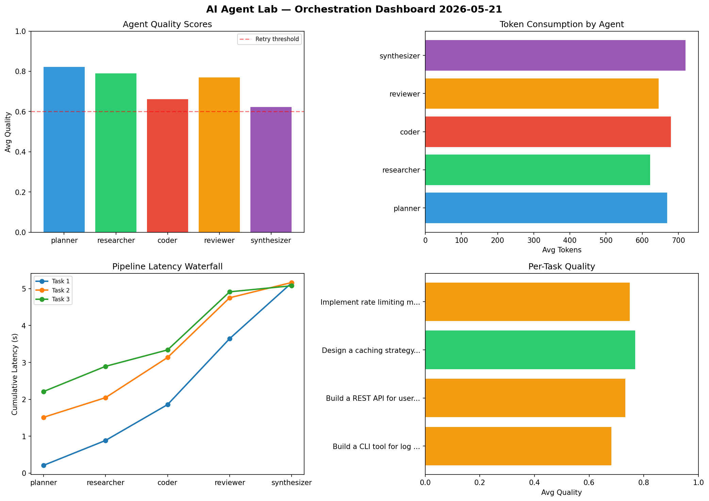

# AI Agent Lab — Orchestration Report 2026-05-21

**Run ID:** `bcf1bc46e0` | **Tasks:** 4 | **Avg Quality:** 0.733

## Aggregate Metrics

| Metric | Value |
|--------|-------|
| avg_latency | 5.805 |
| total_tokens | 13337 |
| avg_quality | 0.733 |

## Delta vs Yesterday

| Metric | Today | Yesterday | Change |
|--------|-------|-----------|--------|
| avg_latency | 5.805 | 6.03 | 📉 -3.7% |
| total_tokens | 13337 | 16022 | 📉 -16.8% |
| avg_quality | 0.733 | 0.712 | 📈 2.9% |

## Pipeline Results

### Build a CLI tool for log analysis
| Agent | Quality | Latency | Tokens | Status |
|-------|---------|---------|--------|--------|
| planner | 0.853 | 0.208s | 869 | success |
| researcher | 0.579 | 0.676s | 767 | needs_retry |
| coder | 0.605 | 0.973s | 521 | success |
| reviewer | 0.711 | 1.789s | 552 | success |
| synthesizer | 0.664 | 1.513s | 566 | success |

### Build a REST API for user authentication
| Agent | Quality | Latency | Tokens | Status |
|-------|---------|---------|--------|--------|
| planner | 0.739 | 1.511s | 391 | success |
| researcher | 0.974 | 0.534s | 509 | success |
| coder | 0.518 | 1.09s | 1003 | needs_retry |
| reviewer | 0.917 | 1.619s | 1133 | success |
| synthesizer | 0.512 | 0.414s | 631 | needs_retry |

### Design a caching strategy for high-traffic endpoints
| Agent | Quality | Latency | Tokens | Status |
|-------|---------|---------|--------|--------|
| planner | 0.827 | 2.21s | 541 | success |
| researcher | 0.688 | 0.684s | 386 | success |
| coder | 0.934 | 0.446s | 231 | success |
| reviewer | 0.66 | 1.575s | 543 | success |
| synthesizer | 0.737 | 0.164s | 932 | success |

### Implement rate limiting middleware
| Agent | Quality | Latency | Tokens | Status |
|-------|---------|---------|--------|--------|
| planner | 0.87 | 0.209s | 874 | success |
| researcher | 0.917 | 1.762s | 825 | success |
| coder | 0.589 | 1.276s | 961 | needs_retry |
| reviewer | 0.79 | 2.107s | 354 | success |
| synthesizer | 0.578 | 2.459s | 748 | needs_retry |
