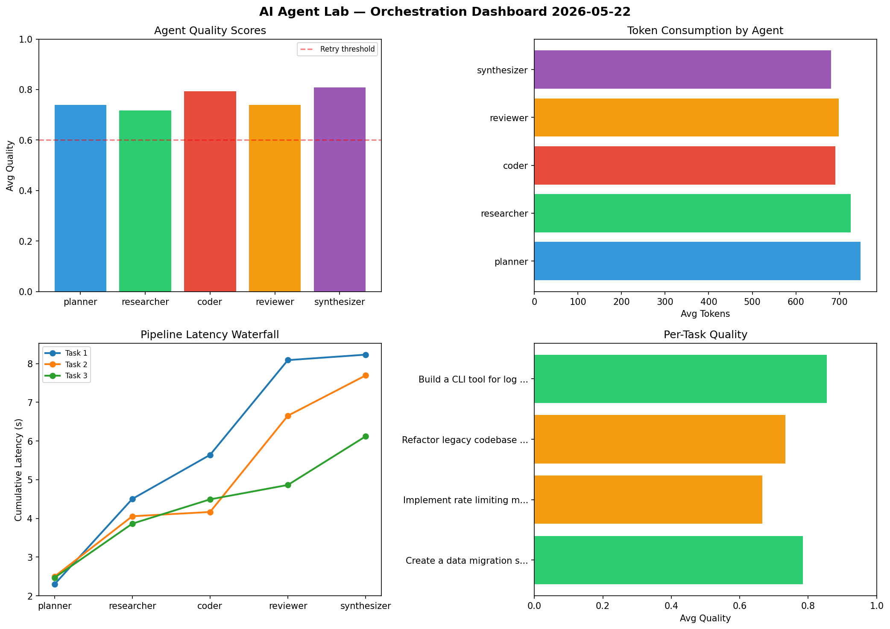

# AI Agent Lab — Orchestration Report 2026-05-22

**Run ID:** `a029f3fe21` | **Tasks:** 4 | **Avg Quality:** 0.759

## Aggregate Metrics

| Metric | Value |
|--------|-------|
| avg_latency | 7.393 |
| total_tokens | 14176 |
| avg_quality | 0.759 |

## Delta vs Yesterday

| Metric | Today | Yesterday | Change |
|--------|-------|-----------|--------|
| avg_latency | 7.393 | 7.953 | 📉 -7.0% |
| total_tokens | 14176 | 14505 | 📉 -2.3% |
| avg_quality | 0.759 | 0.737 | 📈 3.0% |

## Pipeline Results

### Create a data migration script for schema v2
| Agent | Quality | Latency | Tokens | Status |
|-------|---------|---------|--------|--------|
| planner | 0.891 | 2.296s | 495 | success |
| researcher | 0.651 | 2.206s | 897 | success |
| coder | 0.827 | 1.139s | 482 | success |
| reviewer | 0.744 | 2.449s | 769 | success |
| synthesizer | 0.806 | 0.141s | 580 | success |

### Implement rate limiting middleware
| Agent | Quality | Latency | Tokens | Status |
|-------|---------|---------|--------|--------|
| planner | 0.71 | 2.495s | 953 | success |
| researcher | 0.63 | 1.56s | 839 | success |
| coder | 0.599 | 0.11s | 980 | needs_retry |
| reviewer | 0.681 | 2.488s | 672 | success |
| synthesizer | 0.712 | 1.041s | 794 | success |

### Refactor legacy codebase to use dependency injection
| Agent | Quality | Latency | Tokens | Status |
|-------|---------|---------|--------|--------|
| planner | 0.621 | 2.466s | 601 | success |
| researcher | 0.598 | 1.397s | 734 | needs_retry |
| coder | 0.94 | 0.628s | 696 | success |
| reviewer | 0.753 | 0.372s | 470 | success |
| synthesizer | 0.753 | 1.257s | 789 | success |

### Build a CLI tool for log analysis
| Agent | Quality | Latency | Tokens | Status |
|-------|---------|---------|--------|--------|
| planner | 0.735 | 0.95s | 943 | success |
| researcher | 0.989 | 1.369s | 432 | success |
| coder | 0.804 | 2.085s | 606 | success |
| reviewer | 0.779 | 1.988s | 883 | success |
| synthesizer | 0.963 | 1.136s | 561 | success |
