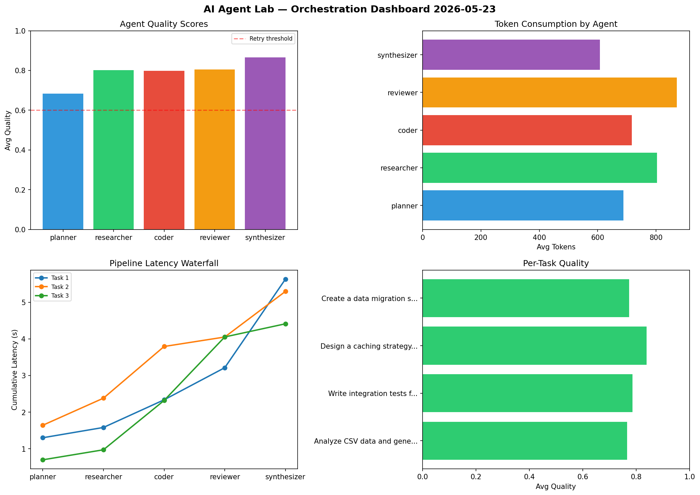

# AI Agent Lab — Orchestration Report 2026-05-23

**Run ID:** `3ba820ff08` | **Tasks:** 4 | **Avg Quality:** 0.791

## Aggregate Metrics

| Metric | Value |
|--------|-------|
| avg_latency | 5.043 |
| total_tokens | 14746 |
| avg_quality | 0.791 |

## Delta vs Yesterday

| Metric | Today | Yesterday | Change |
|--------|-------|-----------|--------|
| avg_latency | 5.043 | 6.557 | 📉 -23.1% |
| total_tokens | 14746 | 14384 | 📈 2.5% |
| avg_quality | 0.791 | 0.754 | 📈 4.9% |

## Pipeline Results

### Analyze CSV data and generate statistical summary
| Agent | Quality | Latency | Tokens | Status |
|-------|---------|---------|--------|--------|
| planner | 0.857 | 1.3s | 526 | success |
| researcher | 0.729 | 0.281s | 1276 | success |
| coder | 0.922 | 0.755s | 614 | success |
| reviewer | 0.623 | 0.878s | 420 | success |
| synthesizer | 0.697 | 2.42s | 806 | success |

### Write integration tests for payment processing module
| Agent | Quality | Latency | Tokens | Status |
|-------|---------|---------|--------|--------|
| planner | 0.632 | 1.641s | 729 | success |
| researcher | 0.754 | 0.74s | 641 | success |
| coder | 0.748 | 1.412s | 859 | success |
| reviewer | 0.828 | 0.259s | 1106 | success |
| synthesizer | 0.966 | 1.246s | 784 | success |

### Design a caching strategy for high-traffic endpoints
| Agent | Quality | Latency | Tokens | Status |
|-------|---------|---------|--------|--------|
| planner | 0.747 | 0.697s | 716 | success |
| researcher | 0.756 | 0.274s | 788 | success |
| coder | 0.88 | 1.347s | 881 | success |
| reviewer | 0.875 | 1.736s | 830 | success |
| synthesizer | 0.935 | 0.359s | 380 | success |

### Create a data migration script for schema v2
| Agent | Quality | Latency | Tokens | Status |
|-------|---------|---------|--------|--------|
| planner | 0.5 | 1.346s | 780 | needs_retry |
| researcher | 0.966 | 0.789s | 510 | success |
| coder | 0.643 | 1.386s | 512 | success |
| reviewer | 0.892 | 0.26s | 1128 | success |
| synthesizer | 0.868 | 1.047s | 460 | success |
