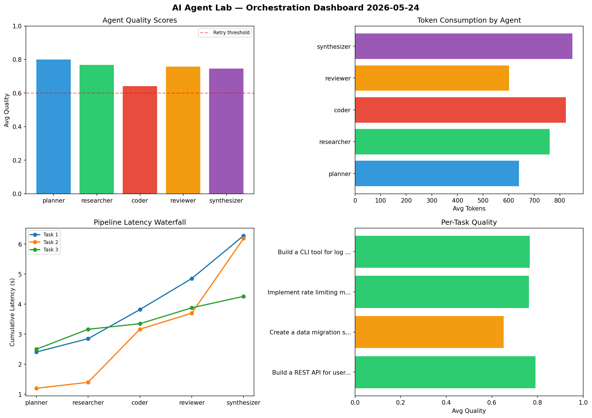

# AI Agent Lab — Orchestration Report 2026-05-24

**Run ID:** `455ac05f96` | **Tasks:** 4 | **Avg Quality:** 0.743

## Aggregate Metrics

| Metric | Value |
|--------|-------|
| avg_latency | 5.784 |
| total_tokens | 14700 |
| avg_quality | 0.743 |

## Delta vs Yesterday

| Metric | Today | Yesterday | Change |
|--------|-------|-----------|--------|
| avg_latency | 5.784 | 5.043 | 📈 14.7% |
| total_tokens | 14700 | 14746 | 📉 -0.3% |
| avg_quality | 0.743 | 0.791 | 📉 -6.1% |

## Pipeline Results

### Build a REST API for user authentication
| Agent | Quality | Latency | Tokens | Status |
|-------|---------|---------|--------|--------|
| planner | 0.804 | 2.407s | 404 | success |
| researcher | 0.753 | 0.444s | 1031 | success |
| coder | 0.579 | 0.97s | 513 | needs_retry |
| reviewer | 0.829 | 1.032s | 428 | success |
| synthesizer | 0.992 | 1.426s | 1121 | success |

### Create a data migration script for schema v2
| Agent | Quality | Latency | Tokens | Status |
|-------|---------|---------|--------|--------|
| planner | 0.883 | 1.2s | 1108 | success |
| researcher | 0.602 | 0.199s | 265 | success |
| coder | 0.566 | 1.769s | 1009 | needs_retry |
| reviewer | 0.63 | 0.531s | 809 | success |
| synthesizer | 0.576 | 2.489s | 1030 | needs_retry |

### Implement rate limiting middleware
| Agent | Quality | Latency | Tokens | Status |
|-------|---------|---------|--------|--------|
| planner | 0.981 | 2.499s | 575 | success |
| researcher | 0.832 | 0.665s | 792 | success |
| coder | 0.677 | 0.186s | 1064 | success |
| reviewer | 0.808 | 0.529s | 612 | success |
| synthesizer | 0.513 | 0.38s | 579 | needs_retry |

### Build a CLI tool for log analysis
| Agent | Quality | Latency | Tokens | Status |
|-------|---------|---------|--------|--------|
| planner | 0.532 | 1.504s | 473 | needs_retry |
| researcher | 0.883 | 2.127s | 955 | success |
| coder | 0.745 | 1.98s | 709 | success |
| reviewer | 0.766 | 0.323s | 559 | success |
| synthesizer | 0.905 | 0.478s | 664 | success |
