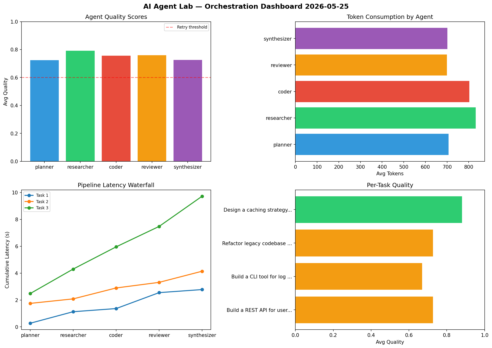

# AI Agent Lab — Orchestration Report 2026-05-25

**Run ID:** `03dce5cb17` | **Tasks:** 4 | **Avg Quality:** 0.751

## Aggregate Metrics

| Metric | Value |
|--------|-------|
| avg_latency | 5.635 |
| total_tokens | 14970 |
| avg_quality | 0.751 |

## Delta vs Yesterday

| Metric | Today | Yesterday | Change |
|--------|-------|-----------|--------|
| avg_latency | 5.635 | 6.82 | 📉 -17.4% |
| total_tokens | 14970 | 11924 | 📈 25.5% |
| avg_quality | 0.751 | 0.798 | 📉 -5.9% |

## Pipeline Results

### Build a REST API for user authentication
| Agent | Quality | Latency | Tokens | Status |
|-------|---------|---------|--------|--------|
| planner | 0.618 | 0.269s | 407 | success |
| researcher | 0.78 | 0.859s | 468 | success |
| coder | 0.735 | 0.235s | 813 | success |
| reviewer | 0.567 | 1.186s | 867 | needs_retry |
| synthesizer | 0.937 | 0.228s | 830 | success |

### Build a CLI tool for log analysis
| Agent | Quality | Latency | Tokens | Status |
|-------|---------|---------|--------|--------|
| planner | 0.681 | 1.748s | 696 | success |
| researcher | 0.798 | 0.335s | 1070 | success |
| coder | 0.539 | 0.813s | 703 | needs_retry |
| reviewer | 0.808 | 0.417s | 718 | success |
| synthesizer | 0.526 | 0.829s | 679 | needs_retry |

### Refactor legacy codebase to use dependency injection
| Agent | Quality | Latency | Tokens | Status |
|-------|---------|---------|--------|--------|
| planner | 0.706 | 2.476s | 1110 | success |
| researcher | 0.633 | 1.825s | 918 | success |
| coder | 0.766 | 1.654s | 995 | success |
| reviewer | 0.714 | 1.521s | 863 | success |
| synthesizer | 0.817 | 2.247s | 253 | success |

### Design a caching strategy for high-traffic endpoints
| Agent | Quality | Latency | Tokens | Status |
|-------|---------|---------|--------|--------|
| planner | 0.894 | 0.726s | 615 | success |
| researcher | 0.957 | 1.122s | 871 | success |
| coder | 0.981 | 1.399s | 700 | success |
| reviewer | 0.948 | 1.348s | 351 | success |
| synthesizer | 0.626 | 1.302s | 1043 | success |
