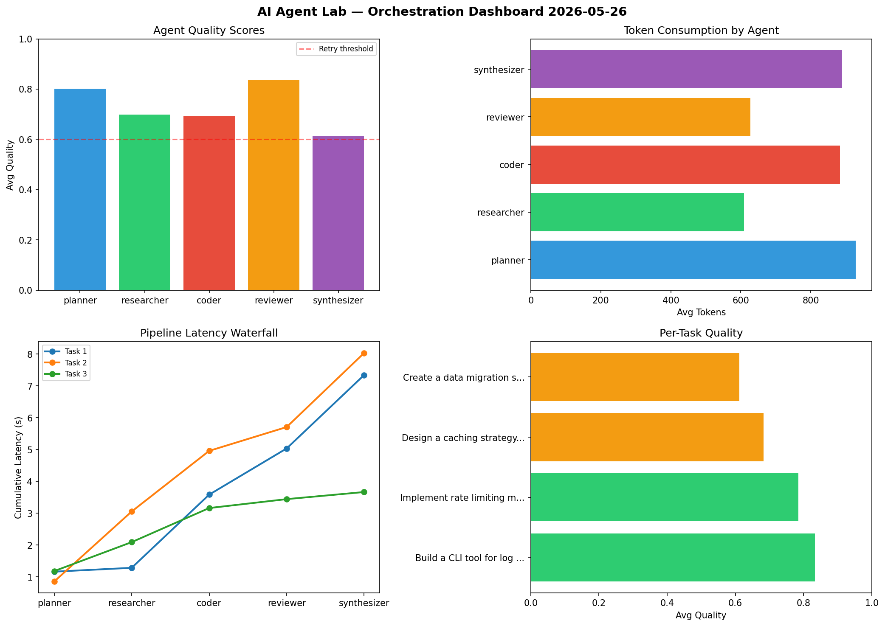

# AI Agent Lab — Orchestration Report 2026-05-26

**Run ID:** `3328061e93` | **Tasks:** 4 | **Avg Quality:** 0.728

## Aggregate Metrics

| Metric | Value |
|--------|-------|
| avg_latency | 6.572 |
| total_tokens | 15748 |
| avg_quality | 0.728 |

## Delta vs Yesterday

| Metric | Today | Yesterday | Change |
|--------|-------|-----------|--------|
| avg_latency | 6.572 | 5.141 | 📈 27.8% |
| total_tokens | 15748 | 13841 | 📈 13.8% |
| avg_quality | 0.728 | 0.734 | 📉 -0.8% |

## Pipeline Results

### Build a CLI tool for log analysis
| Agent | Quality | Latency | Tokens | Status |
|-------|---------|---------|--------|--------|
| planner | 0.899 | 1.166s | 1210 | success |
| researcher | 0.786 | 0.121s | 758 | success |
| coder | 0.979 | 2.297s | 905 | success |
| reviewer | 0.863 | 1.45s | 363 | success |
| synthesizer | 0.638 | 2.305s | 1217 | success |

### Implement rate limiting middleware
| Agent | Quality | Latency | Tokens | Status |
|-------|---------|---------|--------|--------|
| planner | 0.886 | 0.857s | 1007 | success |
| researcher | 0.735 | 2.198s | 753 | success |
| coder | 0.754 | 1.903s | 752 | success |
| reviewer | 0.792 | 0.748s | 366 | success |
| synthesizer | 0.759 | 2.325s | 906 | success |

### Design a caching strategy for high-traffic endpoints
| Agent | Quality | Latency | Tokens | Status |
|-------|---------|---------|--------|--------|
| planner | 0.9 | 1.184s | 646 | success |
| researcher | 0.736 | 0.909s | 647 | success |
| coder | 0.527 | 1.07s | 1059 | needs_retry |
| reviewer | 0.717 | 0.28s | 632 | success |
| synthesizer | 0.537 | 0.223s | 547 | needs_retry |

### Create a data migration script for schema v2
| Agent | Quality | Latency | Tokens | Status |
|-------|---------|---------|--------|--------|
| planner | 0.521 | 1.468s | 848 | needs_retry |
| researcher | 0.535 | 1.71s | 278 | needs_retry |
| coder | 0.512 | 1.528s | 817 | needs_retry |
| reviewer | 0.971 | 1.632s | 1151 | success |
| synthesizer | 0.52 | 0.914s | 886 | needs_retry |
