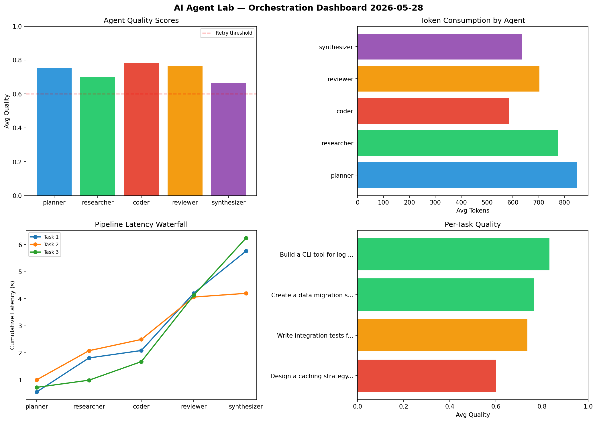

# AI Agent Lab — Orchestration Report 2026-05-28

**Run ID:** `073271cf64` | **Tasks:** 4 | **Avg Quality:** 0.733

## Aggregate Metrics

| Metric | Value |
|--------|-------|
| avg_latency | 6.288 |
| total_tokens | 14183 |
| avg_quality | 0.733 |

## Delta vs Yesterday

| Metric | Today | Yesterday | Change |
|--------|-------|-----------|--------|
| avg_latency | 6.288 | 5.167 | 📈 21.7% |
| total_tokens | 14183 | 14678 | 📉 -3.4% |
| avg_quality | 0.733 | 0.727 | 📈 0.8% |

## Pipeline Results

### Design a caching strategy for high-traffic endpoints
| Agent | Quality | Latency | Tokens | Status |
|-------|---------|---------|--------|--------|
| planner | 0.571 | 0.552s | 1017 | needs_retry |
| researcher | 0.545 | 1.26s | 960 | needs_retry |
| coder | 0.503 | 0.275s | 443 | needs_retry |
| reviewer | 0.556 | 2.12s | 693 | needs_retry |
| synthesizer | 0.826 | 1.56s | 429 | success |

### Write integration tests for payment processing module
| Agent | Quality | Latency | Tokens | Status |
|-------|---------|---------|--------|--------|
| planner | 0.82 | 1.001s | 645 | success |
| researcher | 0.554 | 1.079s | 436 | needs_retry |
| coder | 0.857 | 0.417s | 641 | success |
| reviewer | 0.949 | 1.568s | 583 | success |
| synthesizer | 0.504 | 0.137s | 607 | needs_retry |

### Create a data migration script for schema v2
| Agent | Quality | Latency | Tokens | Status |
|-------|---------|---------|--------|--------|
| planner | 0.698 | 0.724s | 553 | success |
| researcher | 0.779 | 0.265s | 835 | success |
| coder | 0.98 | 0.687s | 483 | success |
| reviewer | 0.792 | 2.452s | 1074 | success |
| synthesizer | 0.578 | 2.123s | 687 | needs_retry |

### Build a CLI tool for log analysis
| Agent | Quality | Latency | Tokens | Status |
|-------|---------|---------|--------|--------|
| planner | 0.92 | 2.337s | 1178 | success |
| researcher | 0.933 | 2.17s | 863 | success |
| coder | 0.802 | 0.343s | 777 | success |
| reviewer | 0.76 | 1.823s | 463 | success |
| synthesizer | 0.743 | 2.257s | 816 | success |
