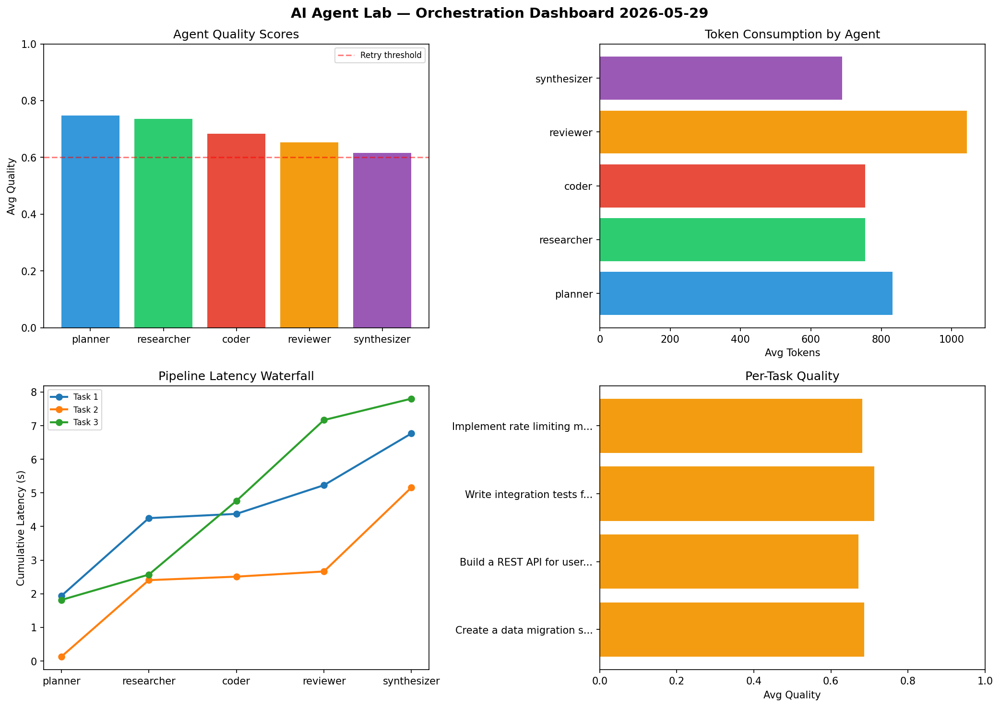

# AI Agent Lab — Orchestration Report 2026-05-29

**Run ID:** `a9fd8a791a` | **Tasks:** 4 | **Avg Quality:** 0.688

## Aggregate Metrics

| Metric | Value |
|--------|-------|
| avg_latency | 6.52 |
| total_tokens | 16285 |
| avg_quality | 0.688 |

## Delta vs Yesterday

| Metric | Today | Yesterday | Change |
|--------|-------|-----------|--------|
| avg_latency | 6.52 | 4.774 | 📈 36.6% |
| total_tokens | 16285 | 15536 | 📈 4.8% |
| avg_quality | 0.688 | 0.768 | 📉 -10.4% |

## Pipeline Results

### Create a data migration script for schema v2
| Agent | Quality | Latency | Tokens | Status |
|-------|---------|---------|--------|--------|
| planner | 0.832 | 1.936s | 1216 | success |
| researcher | 0.707 | 2.314s | 888 | success |
| coder | 0.652 | 0.126s | 605 | success |
| reviewer | 0.645 | 0.853s | 1228 | success |
| synthesizer | 0.593 | 1.54s | 496 | needs_retry |

### Build a REST API for user authentication
| Agent | Quality | Latency | Tokens | Status |
|-------|---------|---------|--------|--------|
| planner | 0.845 | 0.128s | 380 | success |
| researcher | 0.73 | 2.278s | 615 | success |
| coder | 0.601 | 0.104s | 905 | success |
| reviewer | 0.508 | 0.154s | 1106 | needs_retry |
| synthesizer | 0.672 | 2.498s | 1108 | success |

### Write integration tests for payment processing module
| Agent | Quality | Latency | Tokens | Status |
|-------|---------|---------|--------|--------|
| planner | 0.732 | 1.816s | 1067 | success |
| researcher | 0.774 | 0.755s | 734 | success |
| coder | 0.975 | 2.191s | 869 | success |
| reviewer | 0.521 | 2.404s | 978 | needs_retry |
| synthesizer | 0.557 | 0.637s | 542 | needs_retry |

### Implement rate limiting middleware
| Agent | Quality | Latency | Tokens | Status |
|-------|---------|---------|--------|--------|
| planner | 0.583 | 1.631s | 663 | needs_retry |
| researcher | 0.731 | 0.943s | 779 | success |
| coder | 0.505 | 0.674s | 638 | needs_retry |
| reviewer | 0.939 | 1.347s | 859 | success |
| synthesizer | 0.645 | 1.749s | 609 | success |
