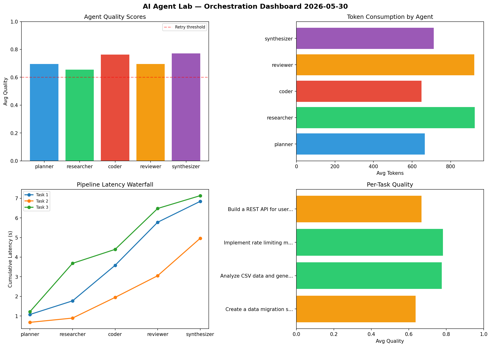

# AI Agent Lab — Orchestration Report 2026-05-30

**Run ID:** `b3a1fd2821` | **Tasks:** 4 | **Avg Quality:** 0.716

## Aggregate Metrics

| Metric | Value |
|--------|-------|
| avg_latency | 6.514 |
| total_tokens | 15499 |
| avg_quality | 0.716 |

## Delta vs Yesterday

| Metric | Today | Yesterday | Change |
|--------|-------|-----------|--------|
| avg_latency | 6.514 | 7.203 | 📉 -9.6% |
| total_tokens | 15499 | 13531 | 📈 14.5% |
| avg_quality | 0.716 | 0.792 | 📉 -9.6% |

## Pipeline Results

### Create a data migration script for schema v2
| Agent | Quality | Latency | Tokens | Status |
|-------|---------|---------|--------|--------|
| planner | 0.593 | 1.079s | 894 | needs_retry |
| researcher | 0.579 | 0.693s | 1132 | needs_retry |
| coder | 0.667 | 1.811s | 522 | success |
| reviewer | 0.592 | 2.195s | 762 | needs_retry |
| synthesizer | 0.753 | 1.064s | 692 | success |

### Analyze CSV data and generate statistical summary
| Agent | Quality | Latency | Tokens | Status |
|-------|---------|---------|--------|--------|
| planner | 0.858 | 0.678s | 870 | success |
| researcher | 0.893 | 0.217s | 1093 | success |
| coder | 0.814 | 1.054s | 1059 | success |
| reviewer | 0.623 | 1.104s | 1024 | success |
| synthesizer | 0.692 | 1.907s | 988 | success |

### Implement rate limiting middleware
| Agent | Quality | Latency | Tokens | Status |
|-------|---------|---------|--------|--------|
| planner | 0.527 | 1.224s | 352 | needs_retry |
| researcher | 0.595 | 2.46s | 687 | needs_retry |
| coder | 0.892 | 0.711s | 477 | success |
| reviewer | 0.972 | 2.084s | 983 | success |
| synthesizer | 0.928 | 0.653s | 762 | success |

### Build a REST API for user authentication
| Agent | Quality | Latency | Tokens | Status |
|-------|---------|---------|--------|--------|
| planner | 0.804 | 1.697s | 549 | success |
| researcher | 0.553 | 2.447s | 788 | needs_retry |
| coder | 0.676 | 0.574s | 537 | success |
| reviewer | 0.595 | 0.426s | 922 | needs_retry |
| synthesizer | 0.712 | 1.978s | 406 | success |
