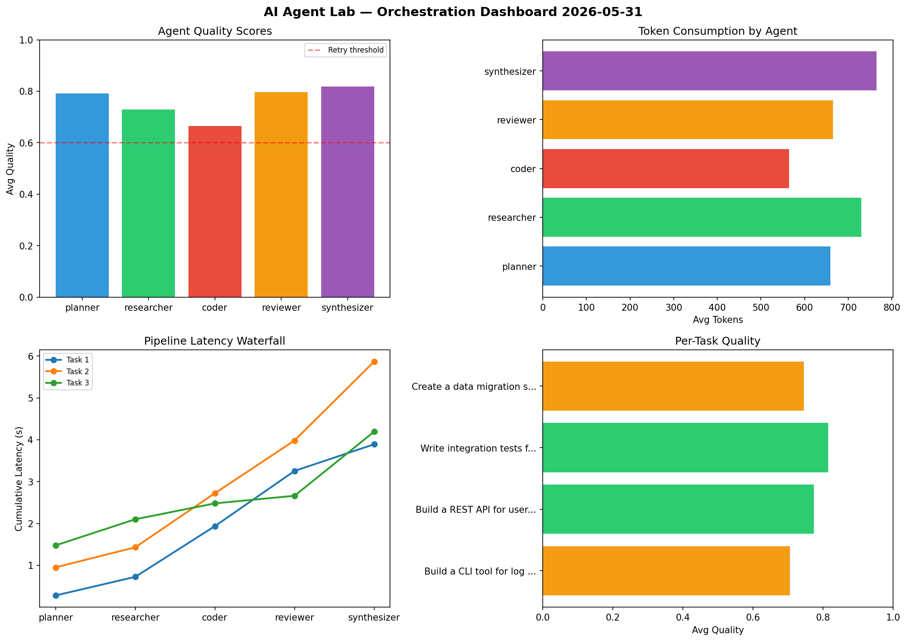

# AI Agent Lab — Orchestration Report 2026-05-31

**Run ID:** `86de9e645d` | **Tasks:** 4 | **Avg Quality:** 0.76

## Aggregate Metrics

| Metric | Value |
|--------|-------|
| avg_latency | 5.07 |
| total_tokens | 13529 |
| avg_quality | 0.76 |

## Delta vs Yesterday

| Metric | Today | Yesterday | Change |
|--------|-------|-----------|--------|
| avg_latency | 5.07 | 7.358 | 📉 -31.1% |
| total_tokens | 13529 | 14064 | 📉 -3.8% |
| avg_quality | 0.76 | 0.734 | 📈 3.5% |

## Pipeline Results

### Build a CLI tool for log analysis
| Agent | Quality | Latency | Tokens | Status |
|-------|---------|---------|--------|--------|
| planner | 0.545 | 0.28s | 984 | needs_retry |
| researcher | 0.624 | 0.444s | 690 | success |
| coder | 0.683 | 1.212s | 806 | success |
| reviewer | 0.943 | 1.319s | 950 | success |
| synthesizer | 0.733 | 0.637s | 828 | success |

### Build a REST API for user authentication
| Agent | Quality | Latency | Tokens | Status |
|-------|---------|---------|--------|--------|
| planner | 0.931 | 0.951s | 398 | success |
| researcher | 0.615 | 0.479s | 794 | success |
| coder | 0.726 | 1.293s | 356 | success |
| reviewer | 0.835 | 1.26s | 768 | success |
| synthesizer | 0.762 | 1.888s | 570 | success |

### Write integration tests for payment processing module
| Agent | Quality | Latency | Tokens | Status |
|-------|---------|---------|--------|--------|
| planner | 0.803 | 1.476s | 716 | success |
| researcher | 0.927 | 0.624s | 710 | success |
| coder | 0.547 | 0.38s | 405 | needs_retry |
| reviewer | 0.812 | 0.181s | 702 | success |
| synthesizer | 0.985 | 1.534s | 437 | success |

### Create a data migration script for schema v2
| Agent | Quality | Latency | Tokens | Status |
|-------|---------|---------|--------|--------|
| planner | 0.888 | 0.157s | 537 | success |
| researcher | 0.747 | 1.546s | 724 | success |
| coder | 0.702 | 2.295s | 689 | success |
| reviewer | 0.598 | 2.025s | 241 | needs_retry |
| synthesizer | 0.792 | 0.298s | 1224 | success |
