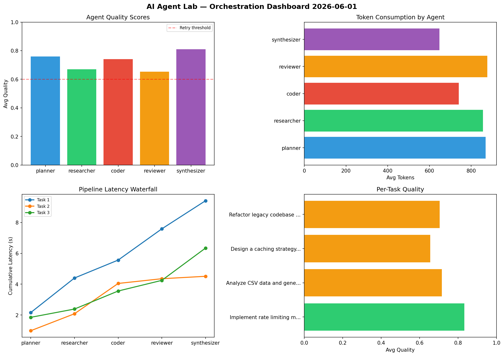

# AI Agent Lab — Orchestration Report 2026-06-01

**Run ID:** `c51f331749` | **Tasks:** 4 | **Avg Quality:** 0.727

## Aggregate Metrics

| Metric | Value |
|--------|-------|
| avg_latency | 7.258 |
| total_tokens | 15960 |
| avg_quality | 0.727 |

## Delta vs Yesterday

| Metric | Today | Yesterday | Change |
|--------|-------|-----------|--------|
| avg_latency | 7.258 | 7.739 | 📉 -6.2% |
| total_tokens | 15960 | 14501 | 📈 10.1% |
| avg_quality | 0.727 | 0.762 | 📉 -4.6% |

## Pipeline Results

### Implement rate limiting middleware
| Agent | Quality | Latency | Tokens | Status |
|-------|---------|---------|--------|--------|
| planner | 0.884 | 2.163s | 1023 | success |
| researcher | 0.774 | 2.237s | 818 | success |
| coder | 0.691 | 1.162s | 855 | success |
| reviewer | 0.951 | 2.024s | 819 | success |
| synthesizer | 0.865 | 1.822s | 669 | success |

### Analyze CSV data and generate statistical summary
| Agent | Quality | Latency | Tokens | Status |
|-------|---------|---------|--------|--------|
| planner | 0.572 | 0.986s | 904 | needs_retry |
| researcher | 0.709 | 1.097s | 925 | success |
| coder | 0.964 | 1.965s | 987 | success |
| reviewer | 0.551 | 0.306s | 830 | needs_retry |
| synthesizer | 0.785 | 0.157s | 533 | success |

### Design a caching strategy for high-traffic endpoints
| Agent | Quality | Latency | Tokens | Status |
|-------|---------|---------|--------|--------|
| planner | 0.62 | 1.853s | 963 | success |
| researcher | 0.623 | 0.536s | 808 | success |
| coder | 0.639 | 1.168s | 428 | success |
| reviewer | 0.524 | 0.691s | 904 | needs_retry |
| synthesizer | 0.867 | 2.092s | 678 | success |

### Refactor legacy codebase to use dependency injection
| Agent | Quality | Latency | Tokens | Status |
|-------|---------|---------|--------|--------|
| planner | 0.962 | 2.099s | 585 | success |
| researcher | 0.577 | 2.268s | 875 | needs_retry |
| coder | 0.669 | 1.417s | 690 | success |
| reviewer | 0.587 | 1.797s | 955 | needs_retry |
| synthesizer | 0.726 | 1.193s | 711 | success |
