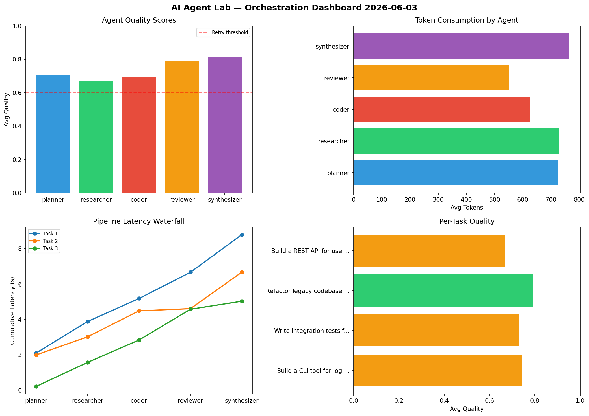

# AI Agent Lab — Orchestration Report 2026-06-03

**Run ID:** `c529679d3b` | **Tasks:** 4 | **Avg Quality:** 0.733

## Aggregate Metrics

| Metric | Value |
|--------|-------|
| avg_latency | 6.96 |
| total_tokens | 13590 |
| avg_quality | 0.733 |

## Delta vs Yesterday

| Metric | Today | Yesterday | Change |
|--------|-------|-----------|--------|
| avg_latency | 6.96 | 7.887 | 📉 -11.8% |
| total_tokens | 13590 | 13746 | 📉 -1.1% |
| avg_quality | 0.733 | 0.804 | 📉 -8.8% |

## Pipeline Results

### Build a CLI tool for log analysis
| Agent | Quality | Latency | Tokens | Status |
|-------|---------|---------|--------|--------|
| planner | 0.583 | 2.094s | 686 | needs_retry |
| researcher | 0.631 | 1.786s | 1064 | success |
| coder | 0.624 | 1.302s | 571 | success |
| reviewer | 0.903 | 1.487s | 392 | success |
| synthesizer | 0.973 | 2.134s | 826 | success |

### Write integration tests for payment processing module
| Agent | Quality | Latency | Tokens | Status |
|-------|---------|---------|--------|--------|
| planner | 0.606 | 1.988s | 801 | success |
| researcher | 0.596 | 1.026s | 840 | needs_retry |
| coder | 0.862 | 1.469s | 388 | success |
| reviewer | 0.934 | 0.126s | 756 | success |
| synthesizer | 0.657 | 2.07s | 916 | success |

### Refactor legacy codebase to use dependency injection
| Agent | Quality | Latency | Tokens | Status |
|-------|---------|---------|--------|--------|
| planner | 0.691 | 0.206s | 725 | success |
| researcher | 0.879 | 1.359s | 667 | success |
| coder | 0.707 | 1.268s | 748 | success |
| reviewer | 0.72 | 1.743s | 792 | success |
| synthesizer | 0.963 | 0.453s | 866 | success |

### Build a REST API for user authentication
| Agent | Quality | Latency | Tokens | Status |
|-------|---------|---------|--------|--------|
| planner | 0.936 | 1.337s | 694 | success |
| researcher | 0.571 | 1.427s | 344 | needs_retry |
| coder | 0.58 | 1.317s | 798 | needs_retry |
| reviewer | 0.597 | 1.665s | 263 | needs_retry |
| synthesizer | 0.652 | 1.581s | 453 | success |
