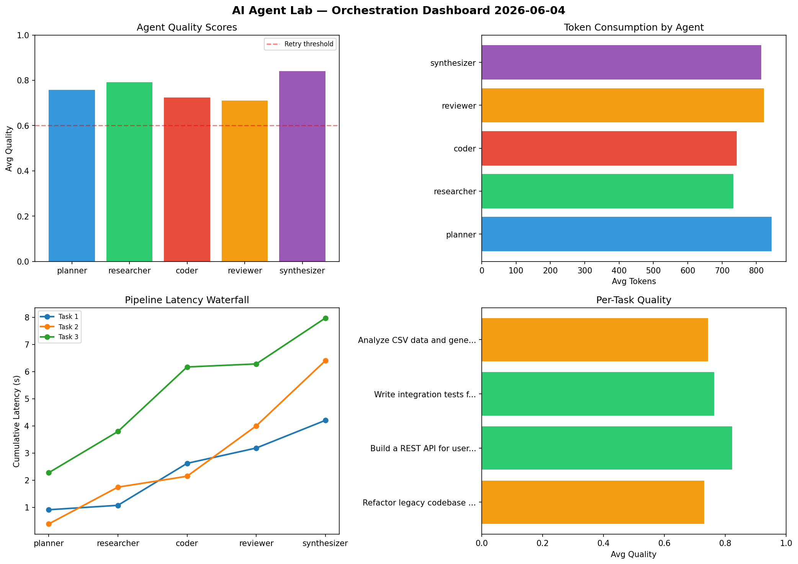

# AI Agent Lab — Orchestration Report 2026-06-04

**Run ID:** `0a56fe9403` | **Tasks:** 4 | **Avg Quality:** 0.765

## Aggregate Metrics

| Metric | Value |
|--------|-------|
| avg_latency | 6.522 |
| total_tokens | 15817 |
| avg_quality | 0.765 |

## Delta vs Yesterday

| Metric | Today | Yesterday | Change |
|--------|-------|-----------|--------|
| avg_latency | 6.522 | 6.96 | 📉 -6.3% |
| total_tokens | 15817 | 13590 | 📈 16.4% |
| avg_quality | 0.765 | 0.733 | 📈 4.4% |

## Pipeline Results

### Refactor legacy codebase to use dependency injection
| Agent | Quality | Latency | Tokens | Status |
|-------|---------|---------|--------|--------|
| planner | 0.855 | 0.912s | 544 | success |
| researcher | 0.687 | 0.163s | 705 | success |
| coder | 0.989 | 1.546s | 911 | success |
| reviewer | 0.508 | 0.564s | 867 | needs_retry |
| synthesizer | 0.616 | 1.02s | 1089 | success |

### Build a REST API for user authentication
| Agent | Quality | Latency | Tokens | Status |
|-------|---------|---------|--------|--------|
| planner | 0.819 | 0.39s | 760 | success |
| researcher | 0.947 | 1.355s | 743 | success |
| coder | 0.869 | 0.401s | 947 | success |
| reviewer | 0.647 | 1.855s | 598 | success |
| synthesizer | 0.833 | 2.403s | 744 | success |

### Write integration tests for payment processing module
| Agent | Quality | Latency | Tokens | Status |
|-------|---------|---------|--------|--------|
| planner | 0.664 | 2.276s | 993 | success |
| researcher | 0.822 | 1.518s | 908 | success |
| coder | 0.526 | 2.377s | 919 | needs_retry |
| reviewer | 0.866 | 0.111s | 981 | success |
| synthesizer | 0.942 | 1.692s | 475 | success |

### Analyze CSV data and generate statistical summary
| Agent | Quality | Latency | Tokens | Status |
|-------|---------|---------|--------|--------|
| planner | 0.695 | 1.799s | 1079 | success |
| researcher | 0.712 | 0.969s | 573 | success |
| coder | 0.515 | 2.112s | 193 | needs_retry |
| reviewer | 0.824 | 2.047s | 839 | success |
| synthesizer | 0.973 | 0.578s | 949 | success |
