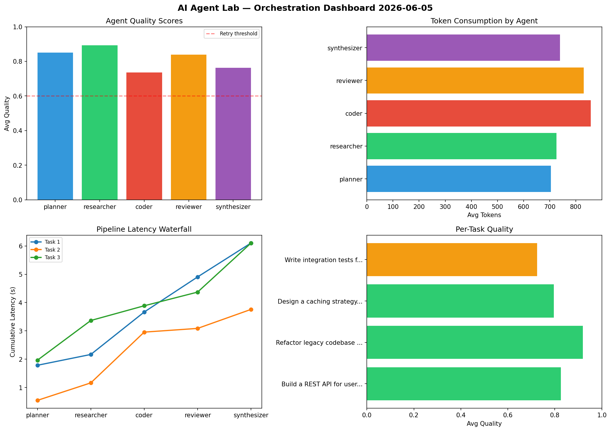

# AI Agent Lab — Orchestration Report 2026-06-05

**Run ID:** `1c824d2d70` | **Tasks:** 4 | **Avg Quality:** 0.816

## Aggregate Metrics

| Metric | Value |
|--------|-------|
| avg_latency | 5.036 |
| total_tokens | 15429 |
| avg_quality | 0.816 |

## Delta vs Yesterday

| Metric | Today | Yesterday | Change |
|--------|-------|-----------|--------|
| avg_latency | 5.036 | 6.768 | 📉 -25.6% |
| total_tokens | 15429 | 13066 | 📈 18.1% |
| avg_quality | 0.816 | 0.766 | 📈 6.5% |

## Pipeline Results

### Build a REST API for user authentication
| Agent | Quality | Latency | Tokens | Status |
|-------|---------|---------|--------|--------|
| planner | 0.702 | 1.786s | 639 | success |
| researcher | 0.911 | 0.382s | 666 | success |
| coder | 0.742 | 1.498s | 849 | success |
| reviewer | 0.929 | 1.24s | 803 | success |
| synthesizer | 0.842 | 1.197s | 887 | success |

### Refactor legacy codebase to use dependency injection
| Agent | Quality | Latency | Tokens | Status |
|-------|---------|---------|--------|--------|
| planner | 0.974 | 0.547s | 227 | success |
| researcher | 0.999 | 0.618s | 861 | success |
| coder | 0.887 | 1.792s | 1129 | success |
| reviewer | 0.972 | 0.131s | 1054 | success |
| synthesizer | 0.765 | 0.671s | 823 | success |

### Design a caching strategy for high-traffic endpoints
| Agent | Quality | Latency | Tokens | Status |
|-------|---------|---------|--------|--------|
| planner | 0.898 | 1.965s | 847 | success |
| researcher | 0.858 | 1.402s | 568 | success |
| coder | 0.511 | 0.52s | 898 | needs_retry |
| reviewer | 0.809 | 0.483s | 343 | success |
| synthesizer | 0.906 | 1.73s | 659 | success |

### Write integration tests for payment processing module
| Agent | Quality | Latency | Tokens | Status |
|-------|---------|---------|--------|--------|
| planner | 0.831 | 1.727s | 1106 | success |
| researcher | 0.803 | 0.832s | 810 | success |
| coder | 0.8 | 1.271s | 552 | success |
| reviewer | 0.648 | 0.162s | 1120 | success |
| synthesizer | 0.536 | 0.189s | 588 | needs_retry |
