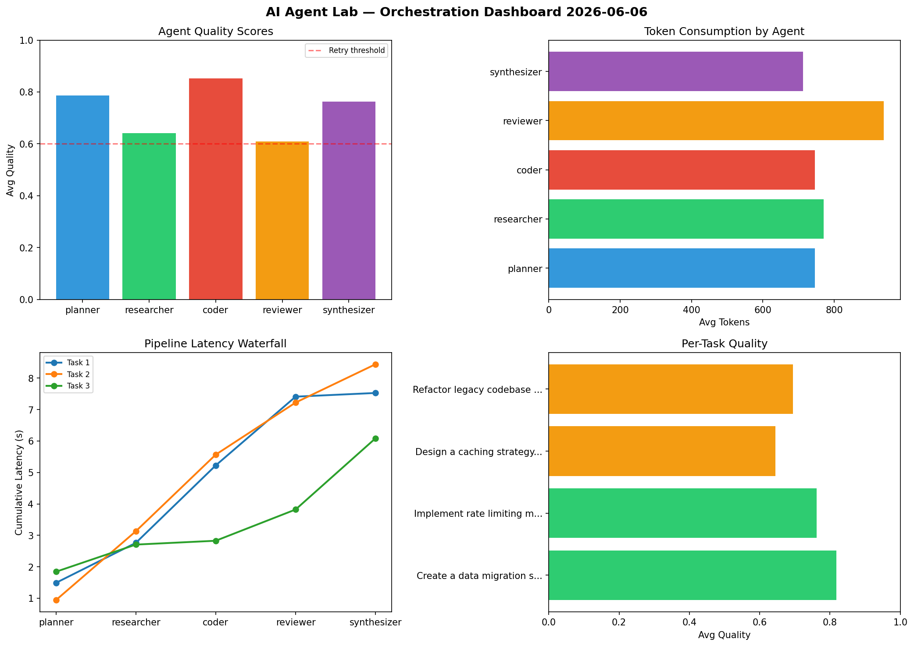

# AI Agent Lab — Orchestration Report 2026-06-06

**Run ID:** `0e703a9e53` | **Tasks:** 4 | **Avg Quality:** 0.73

## Aggregate Metrics

| Metric | Value |
|--------|-------|
| avg_latency | 7.138 |
| total_tokens | 15653 |
| avg_quality | 0.73 |

## Delta vs Yesterday

| Metric | Today | Yesterday | Change |
|--------|-------|-----------|--------|
| avg_latency | 7.138 | 5.591 | 📈 27.7% |
| total_tokens | 15653 | 13576 | 📈 15.3% |
| avg_quality | 0.73 | 0.768 | 📉 -4.9% |

## Pipeline Results

### Create a data migration script for schema v2
| Agent | Quality | Latency | Tokens | Status |
|-------|---------|---------|--------|--------|
| planner | 0.856 | 1.487s | 275 | success |
| researcher | 0.747 | 1.273s | 835 | success |
| coder | 0.932 | 2.464s | 616 | success |
| reviewer | 0.651 | 2.188s | 773 | success |
| synthesizer | 0.904 | 0.117s | 1237 | success |

### Implement rate limiting middleware
| Agent | Quality | Latency | Tokens | Status |
|-------|---------|---------|--------|--------|
| planner | 0.79 | 0.939s | 585 | success |
| researcher | 0.713 | 2.191s | 714 | success |
| coder | 0.999 | 2.437s | 520 | success |
| reviewer | 0.687 | 1.657s | 1081 | success |
| synthesizer | 0.623 | 1.219s | 979 | success |

### Design a caching strategy for high-traffic endpoints
| Agent | Quality | Latency | Tokens | Status |
|-------|---------|---------|--------|--------|
| planner | 0.862 | 1.841s | 908 | success |
| researcher | 0.505 | 0.864s | 642 | needs_retry |
| coder | 0.549 | 0.122s | 795 | needs_retry |
| reviewer | 0.537 | 0.994s | 1077 | needs_retry |
| synthesizer | 0.774 | 2.265s | 208 | success |

### Refactor legacy codebase to use dependency injection
| Agent | Quality | Latency | Tokens | Status |
|-------|---------|---------|--------|--------|
| planner | 0.64 | 0.536s | 1215 | success |
| researcher | 0.597 | 0.74s | 892 | needs_retry |
| coder | 0.927 | 1.735s | 1054 | success |
| reviewer | 0.56 | 2.479s | 822 | needs_retry |
| synthesizer | 0.75 | 1.005s | 425 | success |
