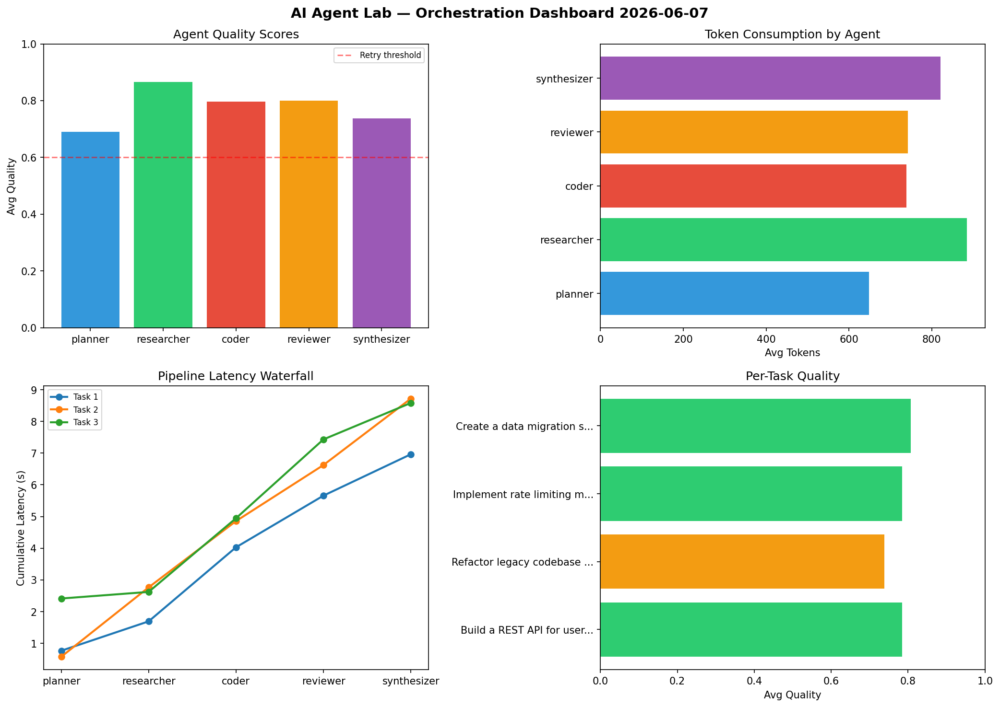

# AI Agent Lab — Orchestration Report 2026-06-07

**Run ID:** `8648260498` | **Tasks:** 4 | **Avg Quality:** 0.779

## Aggregate Metrics

| Metric | Value |
|--------|-------|
| avg_latency | 7.807 |
| total_tokens | 15342 |
| avg_quality | 0.779 |

## Delta vs Yesterday

| Metric | Today | Yesterday | Change |
|--------|-------|-----------|--------|
| avg_latency | 7.807 | 8.457 | 📉 -7.7% |
| total_tokens | 15342 | 13575 | 📈 13.0% |
| avg_quality | 0.779 | 0.733 | 📈 6.3% |

## Pipeline Results

### Build a REST API for user authentication
| Agent | Quality | Latency | Tokens | Status |
|-------|---------|---------|--------|--------|
| planner | 0.752 | 0.766s | 456 | success |
| researcher | 0.829 | 0.927s | 1152 | success |
| coder | 0.805 | 2.337s | 812 | success |
| reviewer | 0.804 | 1.628s | 866 | success |
| synthesizer | 0.733 | 1.305s | 706 | success |

### Refactor legacy codebase to use dependency injection
| Agent | Quality | Latency | Tokens | Status |
|-------|---------|---------|--------|--------|
| planner | 0.733 | 0.577s | 769 | success |
| researcher | 0.675 | 2.188s | 829 | success |
| coder | 0.695 | 2.091s | 619 | success |
| reviewer | 0.796 | 1.767s | 798 | success |
| synthesizer | 0.791 | 2.095s | 769 | success |

### Implement rate limiting middleware
| Agent | Quality | Latency | Tokens | Status |
|-------|---------|---------|--------|--------|
| planner | 0.769 | 2.414s | 931 | success |
| researcher | 0.986 | 0.208s | 397 | success |
| coder | 0.772 | 2.324s | 449 | success |
| reviewer | 0.635 | 2.486s | 353 | success |
| synthesizer | 0.757 | 1.15s | 849 | success |

### Create a data migration script for schema v2
| Agent | Quality | Latency | Tokens | Status |
|-------|---------|---------|--------|--------|
| planner | 0.51 | 2.252s | 439 | needs_retry |
| researcher | 0.971 | 0.258s | 1160 | success |
| coder | 0.915 | 0.771s | 1077 | success |
| reviewer | 0.966 | 2.383s | 951 | success |
| synthesizer | 0.671 | 1.3s | 960 | success |
