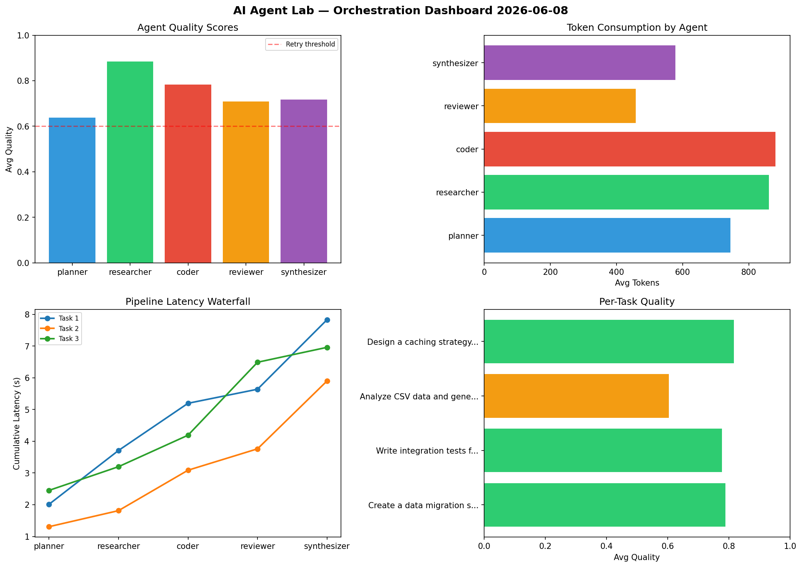

# AI Agent Lab — Orchestration Report 2026-06-08

**Run ID:** `fa617bc132` | **Tasks:** 4 | **Avg Quality:** 0.747

## Aggregate Metrics

| Metric | Value |
|--------|-------|
| avg_latency | 6.695 |
| total_tokens | 14088 |
| avg_quality | 0.747 |

## Delta vs Yesterday

| Metric | Today | Yesterday | Change |
|--------|-------|-----------|--------|
| avg_latency | 6.695 | 7.374 | 📉 -9.2% |
| total_tokens | 14088 | 16499 | 📉 -14.6% |
| avg_quality | 0.747 | 0.792 | 📉 -5.7% |

## Pipeline Results

### Create a data migration script for schema v2
| Agent | Quality | Latency | Tokens | Status |
|-------|---------|---------|--------|--------|
| planner | 0.713 | 2.012s | 1144 | success |
| researcher | 0.933 | 1.697s | 1046 | success |
| coder | 0.665 | 1.487s | 1087 | success |
| reviewer | 0.767 | 0.443s | 269 | success |
| synthesizer | 0.867 | 2.191s | 983 | success |

### Write integration tests for payment processing module
| Agent | Quality | Latency | Tokens | Status |
|-------|---------|---------|--------|--------|
| planner | 0.569 | 1.307s | 569 | needs_retry |
| researcher | 0.929 | 0.506s | 849 | success |
| coder | 0.935 | 1.274s | 947 | success |
| reviewer | 0.918 | 0.674s | 718 | success |
| synthesizer | 0.537 | 2.139s | 495 | needs_retry |

### Analyze CSV data and generate statistical summary
| Agent | Quality | Latency | Tokens | Status |
|-------|---------|---------|--------|--------|
| planner | 0.543 | 2.451s | 354 | needs_retry |
| researcher | 0.705 | 0.747s | 884 | success |
| coder | 0.684 | 0.992s | 709 | success |
| reviewer | 0.517 | 2.299s | 383 | needs_retry |
| synthesizer | 0.569 | 0.47s | 486 | needs_retry |

### Design a caching strategy for high-traffic endpoints
| Agent | Quality | Latency | Tokens | Status |
|-------|---------|---------|--------|--------|
| planner | 0.728 | 0.443s | 912 | success |
| researcher | 0.973 | 2.158s | 664 | success |
| coder | 0.845 | 1.336s | 779 | success |
| reviewer | 0.634 | 0.632s | 463 | success |
| synthesizer | 0.899 | 1.522s | 347 | success |
