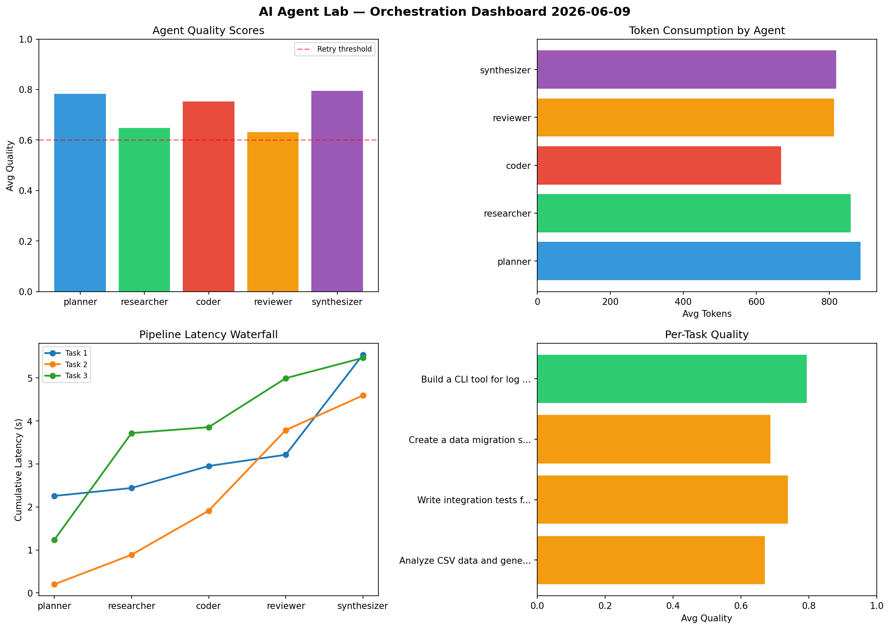

# AI Agent Lab — Orchestration Report 2026-06-09

**Run ID:** `76bdc78d8f` | **Tasks:** 4 | **Avg Quality:** 0.723

## Aggregate Metrics

| Metric | Value |
|--------|-------|
| avg_latency | 5.28 |
| total_tokens | 16168 |
| avg_quality | 0.723 |

## Delta vs Yesterday

| Metric | Today | Yesterday | Change |
|--------|-------|-----------|--------|
| avg_latency | 5.28 | 6.177 | 📉 -14.5% |
| total_tokens | 16168 | 14114 | 📈 14.6% |
| avg_quality | 0.723 | 0.755 | 📉 -4.2% |

## Pipeline Results

### Analyze CSV data and generate statistical summary
| Agent | Quality | Latency | Tokens | Status |
|-------|---------|---------|--------|--------|
| planner | 0.736 | 2.255s | 1218 | success |
| researcher | 0.543 | 0.184s | 923 | needs_retry |
| coder | 0.748 | 0.513s | 549 | success |
| reviewer | 0.685 | 0.261s | 1191 | success |
| synthesizer | 0.645 | 2.328s | 861 | success |

### Write integration tests for payment processing module
| Agent | Quality | Latency | Tokens | Status |
|-------|---------|---------|--------|--------|
| planner | 0.815 | 0.2s | 1020 | success |
| researcher | 0.524 | 0.686s | 1048 | needs_retry |
| coder | 0.875 | 1.026s | 260 | success |
| reviewer | 0.542 | 1.875s | 497 | needs_retry |
| synthesizer | 0.932 | 0.805s | 871 | success |

### Create a data migration script for schema v2
| Agent | Quality | Latency | Tokens | Status |
|-------|---------|---------|--------|--------|
| planner | 0.678 | 1.235s | 896 | success |
| researcher | 0.726 | 2.482s | 689 | success |
| coder | 0.559 | 0.137s | 1059 | needs_retry |
| reviewer | 0.726 | 1.14s | 636 | success |
| synthesizer | 0.744 | 0.472s | 557 | success |

### Build a CLI tool for log analysis
| Agent | Quality | Latency | Tokens | Status |
|-------|---------|---------|--------|--------|
| planner | 0.904 | 0.296s | 405 | success |
| researcher | 0.799 | 1.386s | 771 | success |
| coder | 0.832 | 0.77s | 804 | success |
| reviewer | 0.572 | 1.858s | 927 | needs_retry |
| synthesizer | 0.861 | 1.212s | 986 | success |
