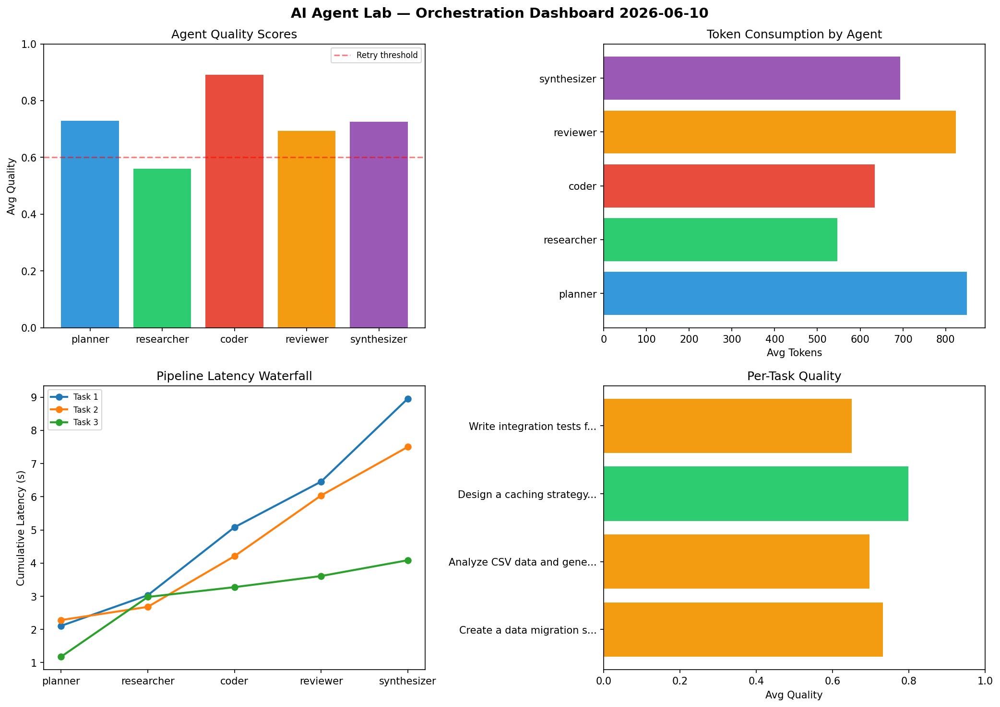

# AI Agent Lab — Orchestration Report 2026-06-10

**Run ID:** `3c794831d5` | **Tasks:** 4 | **Avg Quality:** 0.72

## Aggregate Metrics

| Metric | Value |
|--------|-------|
| avg_latency | 7.075 |
| total_tokens | 14187 |
| avg_quality | 0.72 |

## Delta vs Yesterday

| Metric | Today | Yesterday | Change |
|--------|-------|-----------|--------|
| avg_latency | 7.075 | 5.28 | 📈 34.0% |
| total_tokens | 14187 | 16168 | 📉 -12.3% |
| avg_quality | 0.72 | 0.723 | 📉 -0.4% |

## Pipeline Results

### Create a data migration script for schema v2
| Agent | Quality | Latency | Tokens | Status |
|-------|---------|---------|--------|--------|
| planner | 0.611 | 2.109s | 543 | success |
| researcher | 0.614 | 0.923s | 842 | success |
| coder | 0.952 | 2.047s | 661 | success |
| reviewer | 0.589 | 1.376s | 630 | needs_retry |
| synthesizer | 0.893 | 2.5s | 877 | success |

### Analyze CSV data and generate statistical summary
| Agent | Quality | Latency | Tokens | Status |
|-------|---------|---------|--------|--------|
| planner | 0.806 | 2.283s | 744 | success |
| researcher | 0.545 | 0.398s | 464 | needs_retry |
| coder | 0.8 | 1.526s | 1044 | success |
| reviewer | 0.738 | 1.83s | 909 | success |
| synthesizer | 0.597 | 1.463s | 873 | needs_retry |

### Design a caching strategy for high-traffic endpoints
| Agent | Quality | Latency | Tokens | Status |
|-------|---------|---------|--------|--------|
| planner | 0.665 | 1.178s | 1248 | success |
| researcher | 0.557 | 1.801s | 490 | needs_retry |
| coder | 0.978 | 0.296s | 372 | success |
| reviewer | 0.922 | 0.335s | 1002 | success |
| synthesizer | 0.872 | 0.476s | 772 | success |

### Write integration tests for payment processing module
| Agent | Quality | Latency | Tokens | Status |
|-------|---------|---------|--------|--------|
| planner | 0.834 | 1.254s | 863 | success |
| researcher | 0.528 | 0.427s | 389 | needs_retry |
| coder | 0.832 | 2.165s | 458 | success |
| reviewer | 0.524 | 2.424s | 754 | needs_retry |
| synthesizer | 0.539 | 1.489s | 252 | needs_retry |
