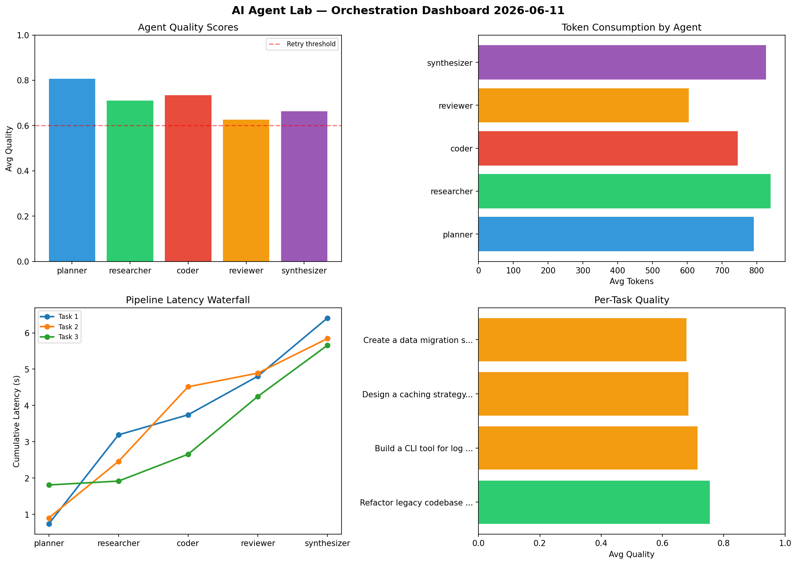

# AI Agent Lab — Orchestration Report 2026-06-11

**Run ID:** `87d18938fb` | **Tasks:** 4 | **Avg Quality:** 0.708

## Aggregate Metrics

| Metric | Value |
|--------|-------|
| avg_latency | 6.629 |
| total_tokens | 15226 |
| avg_quality | 0.708 |

## Delta vs Yesterday

| Metric | Today | Yesterday | Change |
|--------|-------|-----------|--------|
| avg_latency | 6.629 | 7.075 | 📉 -6.3% |
| total_tokens | 15226 | 14187 | 📈 7.3% |
| avg_quality | 0.708 | 0.72 | 📉 -1.7% |

## Pipeline Results

### Refactor legacy codebase to use dependency injection
| Agent | Quality | Latency | Tokens | Status |
|-------|---------|---------|--------|--------|
| planner | 0.8 | 0.735s | 515 | success |
| researcher | 0.744 | 2.455s | 869 | success |
| coder | 0.853 | 0.552s | 789 | success |
| reviewer | 0.609 | 1.063s | 704 | success |
| synthesizer | 0.769 | 1.605s | 764 | success |

### Build a CLI tool for log analysis
| Agent | Quality | Latency | Tokens | Status |
|-------|---------|---------|--------|--------|
| planner | 0.708 | 0.9s | 1124 | success |
| researcher | 0.844 | 1.557s | 974 | success |
| coder | 0.771 | 2.058s | 570 | success |
| reviewer | 0.614 | 0.376s | 475 | success |
| synthesizer | 0.637 | 0.952s | 723 | success |

### Design a caching strategy for high-traffic endpoints
| Agent | Quality | Latency | Tokens | Status |
|-------|---------|---------|--------|--------|
| planner | 0.744 | 1.809s | 800 | success |
| researcher | 0.733 | 0.106s | 564 | success |
| coder | 0.668 | 0.74s | 821 | success |
| reviewer | 0.655 | 1.593s | 803 | success |
| synthesizer | 0.618 | 1.41s | 1040 | success |

### Create a data migration script for schema v2
| Agent | Quality | Latency | Tokens | Status |
|-------|---------|---------|--------|--------|
| planner | 0.972 | 0.208s | 726 | success |
| researcher | 0.52 | 2.166s | 950 | needs_retry |
| coder | 0.645 | 2.496s | 802 | success |
| reviewer | 0.624 | 1.417s | 435 | success |
| synthesizer | 0.628 | 2.317s | 778 | success |
