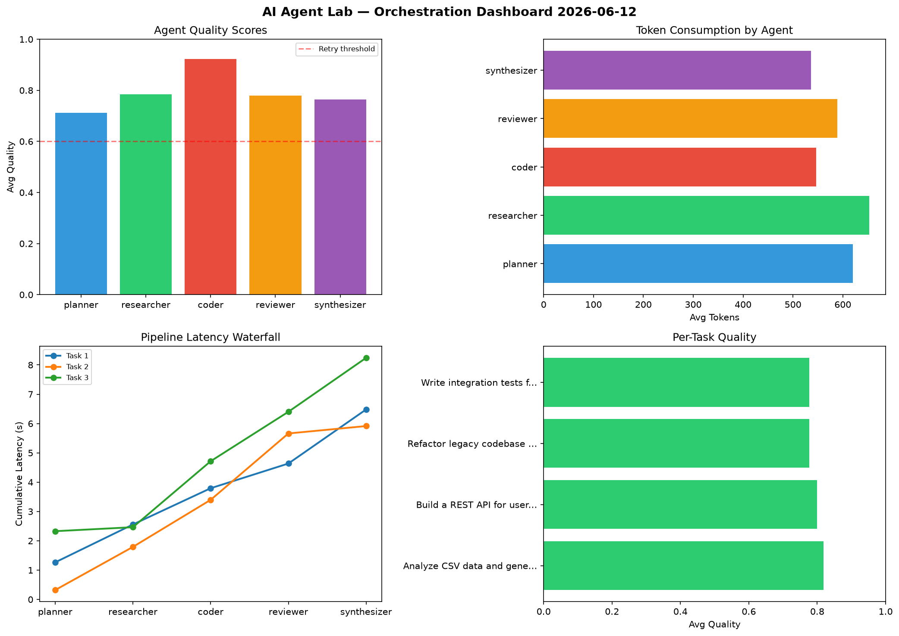

# AI Agent Lab — Orchestration Report 2026-06-12

**Run ID:** `021dd5e437` | **Tasks:** 4 | **Avg Quality:** 0.793

## Aggregate Metrics

| Metric | Value |
|--------|-------|
| avg_latency | 6.925 |
| total_tokens | 11780 |
| avg_quality | 0.793 |

## Delta vs Yesterday

| Metric | Today | Yesterday | Change |
|--------|-------|-----------|--------|
| avg_latency | 6.925 | 7.929 | 📉 -12.7% |
| total_tokens | 11780 | 13103 | 📉 -10.1% |
| avg_quality | 0.793 | 0.754 | 📈 5.2% |

## Pipeline Results

### Analyze CSV data and generate statistical summary
| Agent | Quality | Latency | Tokens | Status |
|-------|---------|---------|--------|--------|
| planner | 0.602 | 1.265s | 726 | success |
| researcher | 0.828 | 1.292s | 337 | success |
| coder | 0.877 | 1.236s | 597 | success |
| reviewer | 0.955 | 0.843s | 599 | success |
| synthesizer | 0.826 | 1.844s | 463 | success |

### Build a REST API for user authentication
| Agent | Quality | Latency | Tokens | Status |
|-------|---------|---------|--------|--------|
| planner | 0.833 | 0.32s | 684 | success |
| researcher | 0.806 | 1.472s | 924 | success |
| coder | 0.96 | 1.605s | 422 | success |
| reviewer | 0.722 | 2.265s | 773 | success |
| synthesizer | 0.677 | 0.252s | 241 | success |

### Refactor legacy codebase to use dependency injection
| Agent | Quality | Latency | Tokens | Status |
|-------|---------|---------|--------|--------|
| planner | 0.836 | 2.328s | 547 | success |
| researcher | 0.697 | 0.136s | 420 | success |
| coder | 0.917 | 2.251s | 270 | success |
| reviewer | 0.783 | 1.686s | 557 | success |
| synthesizer | 0.653 | 1.84s | 685 | success |

### Write integration tests for payment processing module
| Agent | Quality | Latency | Tokens | Status |
|-------|---------|---------|--------|--------|
| planner | 0.58 | 2.066s | 522 | needs_retry |
| researcher | 0.805 | 1.744s | 932 | success |
| coder | 0.939 | 0.12s | 898 | success |
| reviewer | 0.657 | 2.192s | 428 | success |
| synthesizer | 0.904 | 0.944s | 755 | success |
