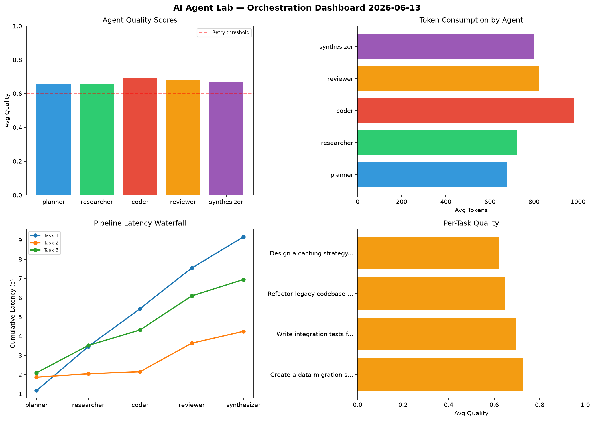

# AI Agent Lab — Orchestration Report 2026-06-13

**Run ID:** `5039b5c34b` | **Tasks:** 4 | **Avg Quality:** 0.672

## Aggregate Metrics

| Metric | Value |
|--------|-------|
| avg_latency | 6.957 |
| total_tokens | 16037 |
| avg_quality | 0.672 |

## Delta vs Yesterday

| Metric | Today | Yesterday | Change |
|--------|-------|-----------|--------|
| avg_latency | 6.957 | 6.447 | 📈 7.9% |
| total_tokens | 16037 | 14716 | 📈 9.0% |
| avg_quality | 0.672 | 0.722 | 📉 -6.9% |

## Pipeline Results

### Create a data migration script for schema v2
| Agent | Quality | Latency | Tokens | Status |
|-------|---------|---------|--------|--------|
| planner | 0.583 | 1.17s | 711 | needs_retry |
| researcher | 0.78 | 2.289s | 754 | success |
| coder | 0.819 | 1.972s | 1063 | success |
| reviewer | 0.926 | 2.117s | 836 | success |
| synthesizer | 0.528 | 1.618s | 671 | needs_retry |

### Write integration tests for payment processing module
| Agent | Quality | Latency | Tokens | Status |
|-------|---------|---------|--------|--------|
| planner | 0.927 | 1.867s | 559 | success |
| researcher | 0.51 | 0.18s | 784 | needs_retry |
| coder | 0.786 | 0.105s | 781 | success |
| reviewer | 0.57 | 1.481s | 1022 | needs_retry |
| synthesizer | 0.684 | 0.615s | 669 | success |

### Refactor legacy codebase to use dependency injection
| Agent | Quality | Latency | Tokens | Status |
|-------|---------|---------|--------|--------|
| planner | 0.577 | 2.097s | 932 | needs_retry |
| researcher | 0.541 | 1.418s | 1051 | needs_retry |
| coder | 0.66 | 0.805s | 1072 | success |
| reviewer | 0.555 | 1.776s | 892 | needs_retry |
| synthesizer | 0.899 | 0.848s | 843 | success |

### Design a caching strategy for high-traffic endpoints
| Agent | Quality | Latency | Tokens | Status |
|-------|---------|---------|--------|--------|
| planner | 0.535 | 0.195s | 513 | needs_retry |
| researcher | 0.797 | 1.438s | 310 | success |
| coder | 0.516 | 1.999s | 1016 | needs_retry |
| reviewer | 0.685 | 1.876s | 536 | success |
| synthesizer | 0.565 | 1.962s | 1022 | needs_retry |
