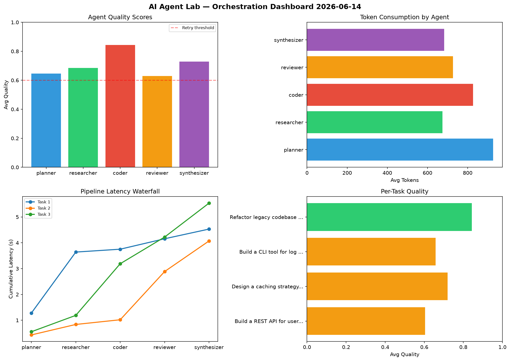

# AI Agent Lab — Orchestration Report 2026-06-14

**Run ID:** `b61e2b3b31` | **Tasks:** 4 | **Avg Quality:** 0.706

## Aggregate Metrics

| Metric | Value |
|--------|-------|
| avg_latency | 5.527 |
| total_tokens | 15349 |
| avg_quality | 0.706 |

## Delta vs Yesterday

| Metric | Today | Yesterday | Change |
|--------|-------|-----------|--------|
| avg_latency | 5.527 | 6.613 | 📉 -16.4% |
| total_tokens | 15349 | 14195 | 📈 8.1% |
| avg_quality | 0.706 | 0.746 | 📉 -5.4% |

## Pipeline Results

### Build a REST API for user authentication
| Agent | Quality | Latency | Tokens | Status |
|-------|---------|---------|--------|--------|
| planner | 0.557 | 1.279s | 780 | needs_retry |
| researcher | 0.576 | 2.361s | 752 | needs_retry |
| coder | 0.799 | 0.111s | 968 | success |
| reviewer | 0.532 | 0.404s | 506 | needs_retry |
| synthesizer | 0.556 | 0.375s | 817 | needs_retry |

### Design a caching strategy for high-traffic endpoints
| Agent | Quality | Latency | Tokens | Status |
|-------|---------|---------|--------|--------|
| planner | 0.521 | 0.432s | 821 | needs_retry |
| researcher | 0.655 | 0.405s | 625 | success |
| coder | 0.947 | 0.182s | 1020 | success |
| reviewer | 0.654 | 1.867s | 773 | success |
| synthesizer | 0.823 | 1.184s | 931 | success |

### Build a CLI tool for log analysis
| Agent | Quality | Latency | Tokens | Status |
|-------|---------|---------|--------|--------|
| planner | 0.51 | 0.555s | 1000 | needs_retry |
| researcher | 0.529 | 0.634s | 704 | needs_retry |
| coder | 0.978 | 1.999s | 796 | success |
| reviewer | 0.591 | 1.033s | 1090 | needs_retry |
| synthesizer | 0.683 | 1.314s | 544 | success |

### Refactor legacy codebase to use dependency injection
| Agent | Quality | Latency | Tokens | Status |
|-------|---------|---------|--------|--------|
| planner | 0.996 | 0.498s | 1106 | success |
| researcher | 0.978 | 1.566s | 616 | success |
| coder | 0.65 | 1.952s | 523 | success |
| reviewer | 0.743 | 1.911s | 537 | success |
| synthesizer | 0.853 | 2.044s | 440 | success |
