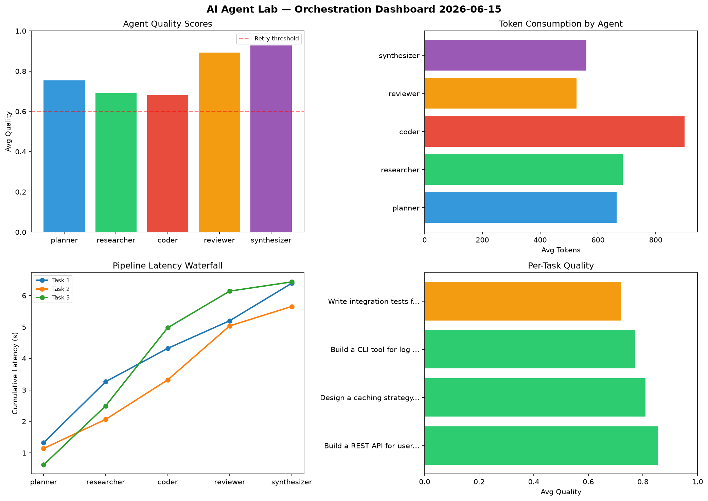

# AI Agent Lab — Orchestration Report 2026-06-15

**Run ID:** `99cad5c5b8` | **Tasks:** 4 | **Avg Quality:** 0.789

## Aggregate Metrics

| Metric | Value |
|--------|-------|
| avg_latency | 6.046 |
| total_tokens | 13346 |
| avg_quality | 0.789 |

## Delta vs Yesterday

| Metric | Today | Yesterday | Change |
|--------|-------|-----------|--------|
| avg_latency | 6.046 | 6.097 | 📉 -0.8% |
| total_tokens | 13346 | 15553 | 📉 -14.2% |
| avg_quality | 0.789 | 0.756 | 📈 4.4% |

## Pipeline Results

### Build a REST API for user authentication
| Agent | Quality | Latency | Tokens | Status |
|-------|---------|---------|--------|--------|
| planner | 0.866 | 1.322s | 590 | success |
| researcher | 0.745 | 1.942s | 553 | success |
| coder | 0.864 | 1.058s | 1026 | success |
| reviewer | 0.994 | 0.879s | 452 | success |
| synthesizer | 0.806 | 1.19s | 210 | success |

### Design a caching strategy for high-traffic endpoints
| Agent | Quality | Latency | Tokens | Status |
|-------|---------|---------|--------|--------|
| planner | 0.837 | 1.14s | 840 | success |
| researcher | 0.734 | 0.926s | 1186 | success |
| coder | 0.69 | 1.255s | 1042 | success |
| reviewer | 0.82 | 1.717s | 578 | success |
| synthesizer | 0.963 | 0.615s | 834 | success |

### Build a CLI tool for log analysis
| Agent | Quality | Latency | Tokens | Status |
|-------|---------|---------|--------|--------|
| planner | 0.708 | 0.622s | 536 | success |
| researcher | 0.692 | 1.873s | 731 | success |
| coder | 0.629 | 2.483s | 961 | success |
| reviewer | 0.857 | 1.164s | 328 | success |
| synthesizer | 0.974 | 0.293s | 634 | success |

### Write integration tests for payment processing module
| Agent | Quality | Latency | Tokens | Status |
|-------|---------|---------|--------|--------|
| planner | 0.608 | 1.681s | 694 | success |
| researcher | 0.59 | 0.436s | 271 | needs_retry |
| coder | 0.538 | 0.692s | 569 | needs_retry |
| reviewer | 0.9 | 1.306s | 747 | success |
| synthesizer | 0.968 | 1.59s | 564 | success |
