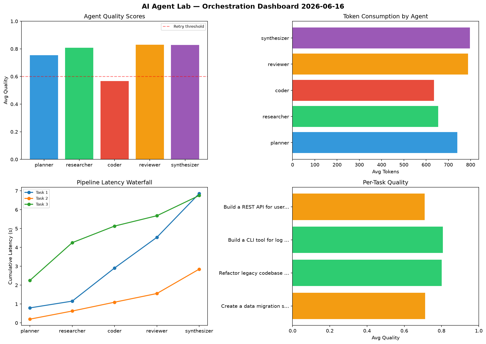

# AI Agent Lab — Orchestration Report 2026-06-16

**Run ID:** `2367be94c8` | **Tasks:** 4 | **Avg Quality:** 0.757

## Aggregate Metrics

| Metric | Value |
|--------|-------|
| avg_latency | 6.238 |
| total_tokens | 14457 |
| avg_quality | 0.757 |

## Delta vs Yesterday

| Metric | Today | Yesterday | Change |
|--------|-------|-----------|--------|
| avg_latency | 6.238 | 5.414 | 📈 15.2% |
| total_tokens | 14457 | 16698 | 📉 -13.4% |
| avg_quality | 0.757 | 0.751 | 📈 0.8% |

## Pipeline Results

### Create a data migration script for schema v2
| Agent | Quality | Latency | Tokens | Status |
|-------|---------|---------|--------|--------|
| planner | 0.871 | 0.796s | 743 | success |
| researcher | 0.574 | 0.358s | 900 | needs_retry |
| coder | 0.625 | 1.756s | 597 | success |
| reviewer | 0.774 | 1.626s | 775 | success |
| synthesizer | 0.715 | 2.32s | 748 | success |

### Refactor legacy codebase to use dependency injection
| Agent | Quality | Latency | Tokens | Status |
|-------|---------|---------|--------|--------|
| planner | 0.963 | 0.199s | 1009 | success |
| researcher | 0.915 | 0.43s | 676 | success |
| coder | 0.56 | 0.468s | 494 | needs_retry |
| reviewer | 0.618 | 0.46s | 857 | success |
| synthesizer | 0.95 | 1.293s | 866 | success |

### Build a CLI tool for log analysis
| Agent | Quality | Latency | Tokens | Status |
|-------|---------|---------|--------|--------|
| planner | 0.642 | 2.252s | 741 | success |
| researcher | 0.996 | 2.001s | 797 | success |
| coder | 0.572 | 0.879s | 803 | needs_retry |
| reviewer | 0.991 | 0.548s | 866 | success |
| synthesizer | 0.834 | 1.073s | 716 | success |

### Build a REST API for user authentication
| Agent | Quality | Latency | Tokens | Status |
|-------|---------|---------|--------|--------|
| planner | 0.539 | 1.904s | 466 | needs_retry |
| researcher | 0.744 | 1.476s | 246 | success |
| coder | 0.513 | 2.08s | 646 | needs_retry |
| reviewer | 0.94 | 0.831s | 654 | success |
| synthesizer | 0.815 | 2.201s | 857 | success |
