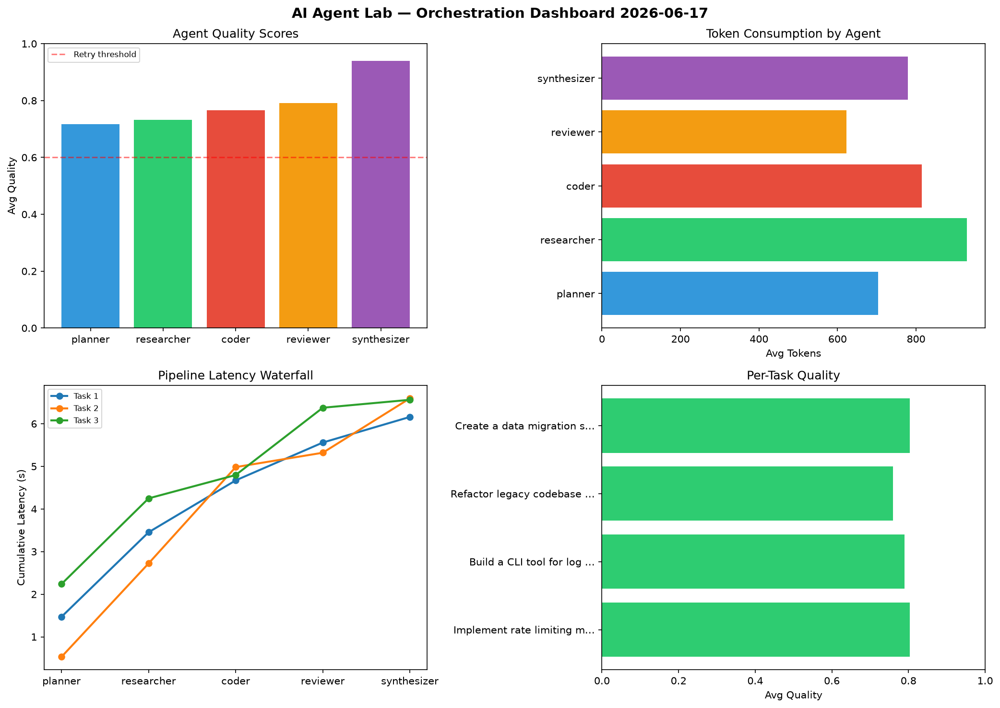

# AI Agent Lab — Orchestration Report 2026-06-17

**Run ID:** `c8dbee76bb` | **Tasks:** 4 | **Avg Quality:** 0.789

## Aggregate Metrics

| Metric | Value |
|--------|-------|
| avg_latency | 6.055 |
| total_tokens | 15401 |
| avg_quality | 0.789 |

## Delta vs Yesterday

| Metric | Today | Yesterday | Change |
|--------|-------|-----------|--------|
| avg_latency | 6.055 | 6.25 | 📉 -3.1% |
| total_tokens | 15401 | 14215 | 📈 8.3% |
| avg_quality | 0.789 | 0.768 | 📈 2.7% |

## Pipeline Results

### Implement rate limiting middleware
| Agent | Quality | Latency | Tokens | Status |
|-------|---------|---------|--------|--------|
| planner | 0.907 | 1.47s | 440 | success |
| researcher | 0.52 | 1.984s | 768 | needs_retry |
| coder | 0.896 | 1.217s | 612 | success |
| reviewer | 0.76 | 0.888s | 928 | success |
| synthesizer | 0.938 | 0.601s | 613 | success |

### Build a CLI tool for log analysis
| Agent | Quality | Latency | Tokens | Status |
|-------|---------|---------|--------|--------|
| planner | 0.713 | 0.53s | 652 | success |
| researcher | 0.902 | 2.193s | 1244 | success |
| coder | 0.601 | 2.26s | 1035 | success |
| reviewer | 0.792 | 0.337s | 873 | success |
| synthesizer | 0.936 | 1.276s | 670 | success |

### Refactor legacy codebase to use dependency injection
| Agent | Quality | Latency | Tokens | Status |
|-------|---------|---------|--------|--------|
| planner | 0.679 | 2.239s | 724 | success |
| researcher | 0.619 | 2.01s | 627 | success |
| coder | 0.843 | 0.548s | 937 | success |
| reviewer | 0.745 | 1.579s | 432 | success |
| synthesizer | 0.911 | 0.186s | 937 | success |

### Create a data migration script for schema v2
| Agent | Quality | Latency | Tokens | Status |
|-------|---------|---------|--------|--------|
| planner | 0.571 | 1.301s | 999 | needs_retry |
| researcher | 0.885 | 0.153s | 1079 | success |
| coder | 0.721 | 1.021s | 674 | success |
| reviewer | 0.868 | 0.283s | 259 | success |
| synthesizer | 0.976 | 2.142s | 898 | success |
