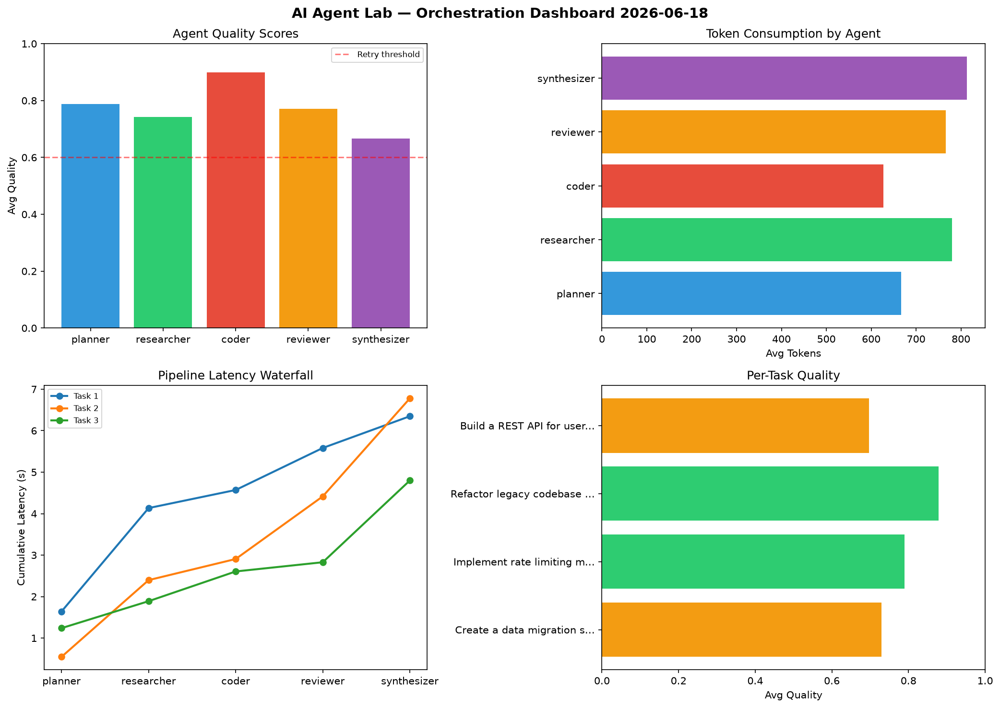

# AI Agent Lab — Orchestration Report 2026-06-18

**Run ID:** `d65e1c5e9a` | **Tasks:** 4 | **Avg Quality:** 0.774

## Aggregate Metrics

| Metric | Value |
|--------|-------|
| avg_latency | 6.06 |
| total_tokens | 14612 |
| avg_quality | 0.774 |

## Delta vs Yesterday

| Metric | Today | Yesterday | Change |
|--------|-------|-----------|--------|
| avg_latency | 6.06 | 5.498 | 📈 10.2% |
| total_tokens | 14612 | 13497 | 📈 8.3% |
| avg_quality | 0.774 | 0.733 | 📈 5.6% |

## Pipeline Results

### Create a data migration script for schema v2
| Agent | Quality | Latency | Tokens | Status |
|-------|---------|---------|--------|--------|
| planner | 0.654 | 1.641s | 453 | success |
| researcher | 0.997 | 2.493s | 1065 | success |
| coder | 0.975 | 0.436s | 785 | success |
| reviewer | 0.514 | 1.013s | 901 | needs_retry |
| synthesizer | 0.51 | 0.765s | 1008 | needs_retry |

### Implement rate limiting middleware
| Agent | Quality | Latency | Tokens | Status |
|-------|---------|---------|--------|--------|
| planner | 0.905 | 0.547s | 744 | success |
| researcher | 0.506 | 1.85s | 1193 | needs_retry |
| coder | 0.922 | 0.509s | 379 | success |
| reviewer | 0.977 | 1.51s | 570 | success |
| synthesizer | 0.639 | 2.363s | 775 | success |

### Refactor legacy codebase to use dependency injection
| Agent | Quality | Latency | Tokens | Status |
|-------|---------|---------|--------|--------|
| planner | 0.829 | 1.239s | 871 | success |
| researcher | 0.854 | 0.65s | 328 | success |
| coder | 0.764 | 0.717s | 470 | success |
| reviewer | 0.972 | 0.222s | 811 | success |
| synthesizer | 0.97 | 1.971s | 885 | success |

### Build a REST API for user authentication
| Agent | Quality | Latency | Tokens | Status |
|-------|---------|---------|--------|--------|
| planner | 0.764 | 1.099s | 597 | success |
| researcher | 0.615 | 2.241s | 534 | success |
| coder | 0.935 | 0.179s | 875 | success |
| reviewer | 0.624 | 0.432s | 783 | success |
| synthesizer | 0.548 | 2.364s | 585 | needs_retry |
