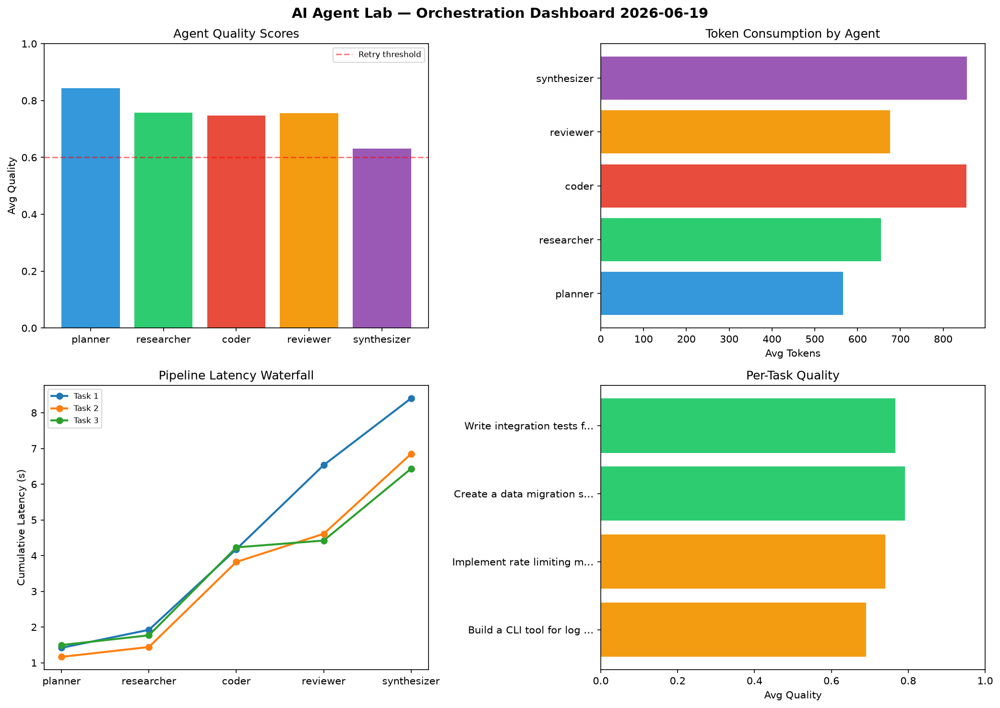

# AI Agent Lab — Orchestration Report 2026-06-19

**Run ID:** `d6a6c78e05` | **Tasks:** 4 | **Avg Quality:** 0.747

## Aggregate Metrics

| Metric | Value |
|--------|-------|
| avg_latency | 7.591 |
| total_tokens | 14422 |
| avg_quality | 0.747 |

## Delta vs Yesterday

| Metric | Today | Yesterday | Change |
|--------|-------|-----------|--------|
| avg_latency | 7.591 | 6.279 | 📈 20.9% |
| total_tokens | 14422 | 15612 | 📉 -7.6% |
| avg_quality | 0.747 | 0.792 | 📉 -5.7% |

## Pipeline Results

### Build a CLI tool for log analysis
| Agent | Quality | Latency | Tokens | Status |
|-------|---------|---------|--------|--------|
| planner | 0.979 | 1.419s | 736 | success |
| researcher | 0.735 | 0.504s | 670 | success |
| coder | 0.596 | 2.256s | 534 | needs_retry |
| reviewer | 0.542 | 2.355s | 584 | needs_retry |
| synthesizer | 0.604 | 1.869s | 1130 | success |

### Implement rate limiting middleware
| Agent | Quality | Latency | Tokens | Status |
|-------|---------|---------|--------|--------|
| planner | 0.958 | 1.166s | 360 | success |
| researcher | 0.621 | 0.276s | 1202 | success |
| coder | 0.978 | 2.381s | 906 | success |
| reviewer | 0.639 | 0.787s | 759 | success |
| synthesizer | 0.502 | 2.237s | 1266 | needs_retry |

### Create a data migration script for schema v2
| Agent | Quality | Latency | Tokens | Status |
|-------|---------|---------|--------|--------|
| planner | 0.612 | 1.497s | 573 | success |
| researcher | 0.92 | 0.272s | 391 | success |
| coder | 0.68 | 2.462s | 977 | success |
| reviewer | 0.914 | 0.191s | 765 | success |
| synthesizer | 0.827 | 2.011s | 391 | success |

### Write integration tests for payment processing module
| Agent | Quality | Latency | Tokens | Status |
|-------|---------|---------|--------|--------|
| planner | 0.828 | 2.099s | 595 | success |
| researcher | 0.754 | 1.108s | 354 | success |
| coder | 0.734 | 1.687s | 1001 | success |
| reviewer | 0.931 | 1.919s | 594 | success |
| synthesizer | 0.588 | 1.869s | 634 | needs_retry |
