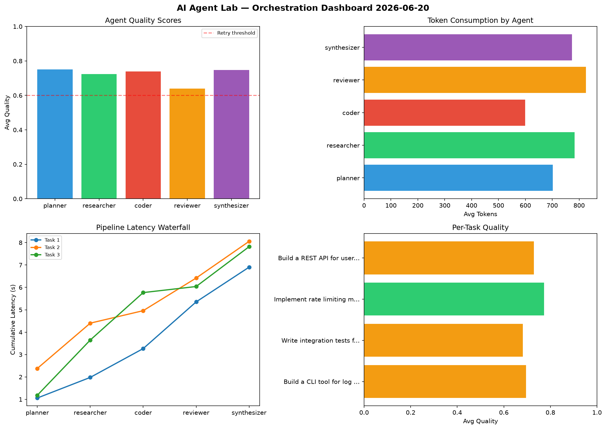

# AI Agent Lab — Orchestration Report 2026-06-20

**Run ID:** `4f22f88c2d` | **Tasks:** 4 | **Avg Quality:** 0.72

## Aggregate Metrics

| Metric | Value |
|--------|-------|
| avg_latency | 7.019 |
| total_tokens | 14735 |
| avg_quality | 0.72 |

## Delta vs Yesterday

| Metric | Today | Yesterday | Change |
|--------|-------|-----------|--------|
| avg_latency | 7.019 | 6.845 | 📈 2.5% |
| total_tokens | 14735 | 13219 | 📈 11.5% |
| avg_quality | 0.72 | 0.783 | 📉 -8.0% |

## Pipeline Results

### Build a CLI tool for log analysis
| Agent | Quality | Latency | Tokens | Status |
|-------|---------|---------|--------|--------|
| planner | 0.772 | 1.06s | 428 | success |
| researcher | 0.629 | 0.92s | 265 | success |
| coder | 0.758 | 1.287s | 372 | success |
| reviewer | 0.603 | 2.085s | 798 | success |
| synthesizer | 0.714 | 1.551s | 919 | success |

### Write integration tests for payment processing module
| Agent | Quality | Latency | Tokens | Status |
|-------|---------|---------|--------|--------|
| planner | 0.555 | 2.38s | 667 | needs_retry |
| researcher | 0.955 | 2.023s | 986 | success |
| coder | 0.718 | 0.557s | 687 | success |
| reviewer | 0.54 | 1.458s | 1002 | needs_retry |
| synthesizer | 0.643 | 1.637s | 769 | success |

### Implement rate limiting middleware
| Agent | Quality | Latency | Tokens | Status |
|-------|---------|---------|--------|--------|
| planner | 0.902 | 1.183s | 844 | success |
| researcher | 0.76 | 2.466s | 644 | success |
| coder | 0.915 | 2.119s | 556 | success |
| reviewer | 0.632 | 0.271s | 937 | success |
| synthesizer | 0.655 | 1.778s | 767 | success |

### Build a REST API for user authentication
| Agent | Quality | Latency | Tokens | Status |
|-------|---------|---------|--------|--------|
| planner | 0.773 | 1.576s | 871 | success |
| researcher | 0.548 | 0.262s | 1240 | needs_retry |
| coder | 0.566 | 1.665s | 782 | needs_retry |
| reviewer | 0.782 | 0.399s | 564 | success |
| synthesizer | 0.977 | 1.4s | 637 | success |
