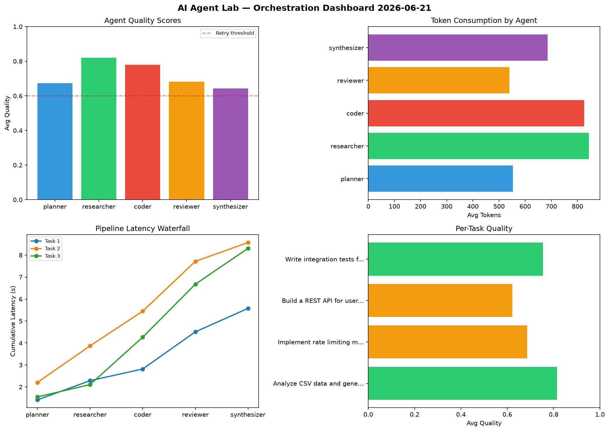

# AI Agent Lab — Orchestration Report 2026-06-21

**Run ID:** `477a192b9a` | **Tasks:** 4 | **Avg Quality:** 0.719

## Aggregate Metrics

| Metric | Value |
|--------|-------|
| avg_latency | 6.985 |
| total_tokens | 13789 |
| avg_quality | 0.719 |

## Delta vs Yesterday

| Metric | Today | Yesterday | Change |
|--------|-------|-----------|--------|
| avg_latency | 6.985 | 6.891 | 📈 1.4% |
| total_tokens | 13789 | 18175 | 📉 -24.1% |
| avg_quality | 0.719 | 0.791 | 📉 -9.1% |

## Pipeline Results

### Analyze CSV data and generate statistical summary
| Agent | Quality | Latency | Tokens | Status |
|-------|---------|---------|--------|--------|
| planner | 0.864 | 1.412s | 473 | success |
| researcher | 0.704 | 0.874s | 827 | success |
| coder | 0.916 | 0.531s | 955 | success |
| reviewer | 0.754 | 1.692s | 848 | success |
| synthesizer | 0.838 | 1.067s | 850 | success |

### Implement rate limiting middleware
| Agent | Quality | Latency | Tokens | Status |
|-------|---------|---------|--------|--------|
| planner | 0.631 | 2.206s | 467 | success |
| researcher | 0.957 | 1.665s | 783 | success |
| coder | 0.761 | 1.578s | 475 | success |
| reviewer | 0.541 | 2.269s | 466 | needs_retry |
| synthesizer | 0.54 | 0.857s | 727 | needs_retry |

### Build a REST API for user authentication
| Agent | Quality | Latency | Tokens | Status |
|-------|---------|---------|--------|--------|
| planner | 0.537 | 1.547s | 704 | needs_retry |
| researcher | 0.71 | 0.56s | 974 | success |
| coder | 0.641 | 2.159s | 889 | success |
| reviewer | 0.584 | 2.413s | 209 | needs_retry |
| synthesizer | 0.64 | 1.631s | 850 | success |

### Write integration tests for payment processing module
| Agent | Quality | Latency | Tokens | Status |
|-------|---------|---------|--------|--------|
| planner | 0.662 | 2.205s | 568 | success |
| researcher | 0.909 | 0.192s | 791 | success |
| coder | 0.798 | 1.491s | 983 | success |
| reviewer | 0.845 | 1.126s | 635 | success |
| synthesizer | 0.556 | 0.466s | 315 | needs_retry |
