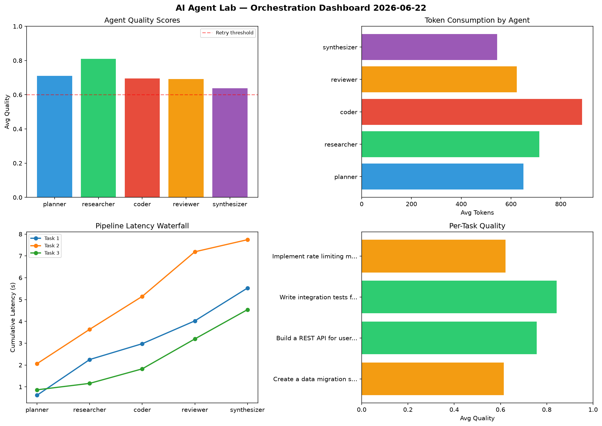

# AI Agent Lab — Orchestration Report 2026-06-22

**Run ID:** `42b95543c0` | **Tasks:** 4 | **Avg Quality:** 0.709

## Aggregate Metrics

| Metric | Value |
|--------|-------|
| avg_latency | 6.757 |
| total_tokens | 13668 |
| avg_quality | 0.709 |

## Delta vs Yesterday

| Metric | Today | Yesterday | Change |
|--------|-------|-----------|--------|
| avg_latency | 6.757 | 7.231 | 📉 -6.6% |
| total_tokens | 13668 | 14204 | 📉 -3.8% |
| avg_quality | 0.709 | 0.728 | 📉 -2.6% |

## Pipeline Results

### Create a data migration script for schema v2
| Agent | Quality | Latency | Tokens | Status |
|-------|---------|---------|--------|--------|
| planner | 0.819 | 0.617s | 824 | success |
| researcher | 0.577 | 1.635s | 973 | needs_retry |
| coder | 0.515 | 0.726s | 913 | needs_retry |
| reviewer | 0.602 | 1.046s | 1038 | success |
| synthesizer | 0.558 | 1.504s | 292 | needs_retry |

### Build a REST API for user authentication
| Agent | Quality | Latency | Tokens | Status |
|-------|---------|---------|--------|--------|
| planner | 0.74 | 2.064s | 825 | success |
| researcher | 0.929 | 1.573s | 805 | success |
| coder | 0.672 | 1.51s | 838 | success |
| reviewer | 0.934 | 2.043s | 247 | success |
| synthesizer | 0.512 | 0.554s | 787 | needs_retry |

### Write integration tests for payment processing module
| Agent | Quality | Latency | Tokens | Status |
|-------|---------|---------|--------|--------|
| planner | 0.76 | 0.865s | 622 | success |
| researcher | 0.99 | 0.295s | 822 | success |
| coder | 0.834 | 0.666s | 843 | success |
| reviewer | 0.722 | 1.371s | 927 | success |
| synthesizer | 0.907 | 1.341s | 669 | success |

### Implement rate limiting middleware
| Agent | Quality | Latency | Tokens | Status |
|-------|---------|---------|--------|--------|
| planner | 0.524 | 1.66s | 327 | needs_retry |
| researcher | 0.74 | 2.421s | 254 | success |
| coder | 0.762 | 1.916s | 948 | success |
| reviewer | 0.507 | 0.915s | 283 | needs_retry |
| synthesizer | 0.575 | 2.307s | 431 | needs_retry |
