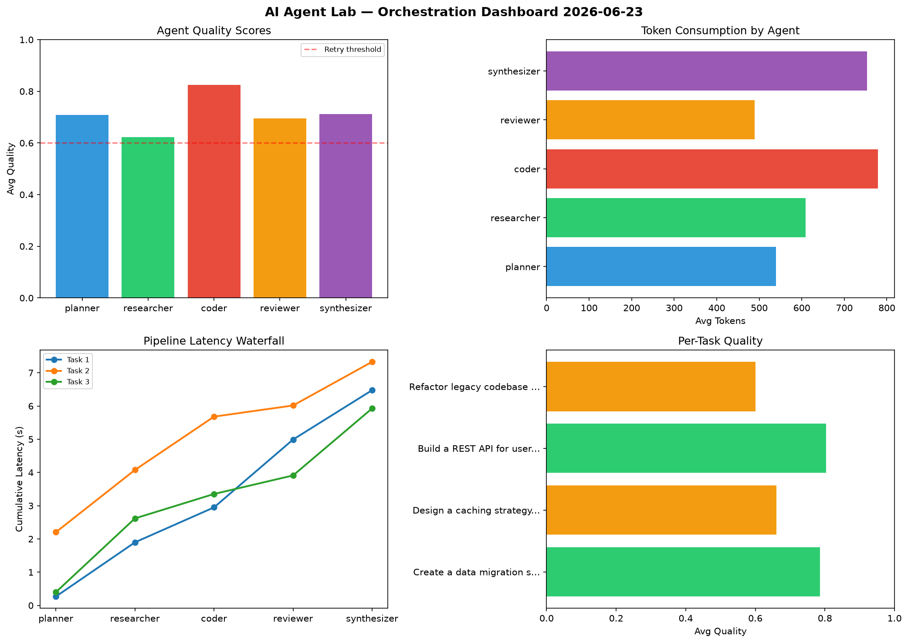

# AI Agent Lab — Orchestration Report 2026-06-23

**Run ID:** `6f1f55e2c0` | **Tasks:** 4 | **Avg Quality:** 0.713

## Aggregate Metrics

| Metric | Value |
|--------|-------|
| avg_latency | 6.223 |
| total_tokens | 12682 |
| avg_quality | 0.713 |

## Delta vs Yesterday

| Metric | Today | Yesterday | Change |
|--------|-------|-----------|--------|
| avg_latency | 6.223 | 6.757 | 📉 -7.9% |
| total_tokens | 12682 | 13668 | 📉 -7.2% |
| avg_quality | 0.713 | 0.709 | 📈 0.6% |

## Pipeline Results

### Create a data migration script for schema v2
| Agent | Quality | Latency | Tokens | Status |
|-------|---------|---------|--------|--------|
| planner | 0.908 | 0.267s | 654 | success |
| researcher | 0.613 | 1.631s | 479 | success |
| coder | 0.956 | 1.052s | 556 | success |
| reviewer | 0.615 | 2.042s | 307 | success |
| synthesizer | 0.84 | 1.485s | 852 | success |

### Design a caching strategy for high-traffic endpoints
| Agent | Quality | Latency | Tokens | Status |
|-------|---------|---------|--------|--------|
| planner | 0.683 | 2.203s | 482 | success |
| researcher | 0.506 | 1.874s | 744 | needs_retry |
| coder | 0.758 | 1.604s | 1013 | success |
| reviewer | 0.664 | 0.335s | 480 | success |
| synthesizer | 0.689 | 1.315s | 723 | success |

### Build a REST API for user authentication
| Agent | Quality | Latency | Tokens | Status |
|-------|---------|---------|--------|--------|
| planner | 0.604 | 0.398s | 259 | success |
| researcher | 0.754 | 2.22s | 667 | success |
| coder | 0.93 | 0.735s | 763 | success |
| reviewer | 0.941 | 0.558s | 466 | success |
| synthesizer | 0.79 | 2.018s | 229 | success |

### Refactor legacy codebase to use dependency injection
| Agent | Quality | Latency | Tokens | Status |
|-------|---------|---------|--------|--------|
| planner | 0.642 | 1.339s | 762 | success |
| researcher | 0.618 | 0.193s | 548 | success |
| coder | 0.655 | 0.584s | 784 | success |
| reviewer | 0.563 | 0.977s | 705 | needs_retry |
| synthesizer | 0.528 | 2.062s | 1209 | needs_retry |
