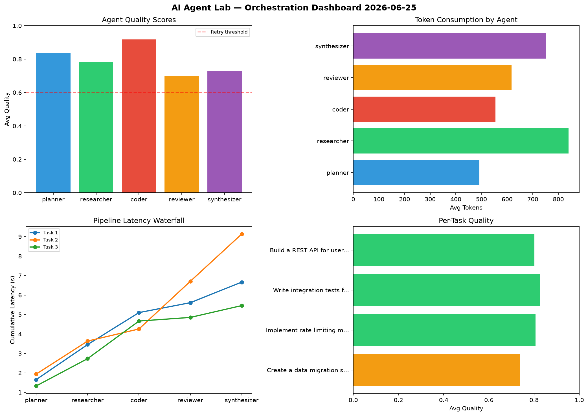

# AI Agent Lab — Orchestration Report 2026-06-25

**Run ID:** `da577f9d9f` | **Tasks:** 4 | **Avg Quality:** 0.793

## Aggregate Metrics

| Metric | Value |
|--------|-------|
| avg_latency | 7.254 |
| total_tokens | 13024 |
| avg_quality | 0.793 |

## Delta vs Yesterday

| Metric | Today | Yesterday | Change |
|--------|-------|-----------|--------|
| avg_latency | 7.254 | 6.847 | 📈 5.9% |
| total_tokens | 13024 | 11863 | 📈 9.8% |
| avg_quality | 0.793 | 0.799 | 📉 -0.8% |

## Pipeline Results

### Create a data migration script for schema v2
| Agent | Quality | Latency | Tokens | Status |
|-------|---------|---------|--------|--------|
| planner | 0.604 | 1.653s | 648 | success |
| researcher | 0.575 | 1.8s | 881 | needs_retry |
| coder | 0.99 | 1.644s | 159 | success |
| reviewer | 0.766 | 0.51s | 631 | success |
| synthesizer | 0.749 | 1.058s | 604 | success |

### Implement rate limiting middleware
| Agent | Quality | Latency | Tokens | Status |
|-------|---------|---------|--------|--------|
| planner | 0.887 | 1.938s | 526 | success |
| researcher | 0.709 | 1.694s | 847 | success |
| coder | 0.994 | 0.623s | 762 | success |
| reviewer | 0.893 | 2.451s | 640 | success |
| synthesizer | 0.55 | 2.429s | 527 | needs_retry |

### Write integration tests for payment processing module
| Agent | Quality | Latency | Tokens | Status |
|-------|---------|---------|--------|--------|
| planner | 0.94 | 1.326s | 339 | success |
| researcher | 0.989 | 1.403s | 884 | success |
| coder | 0.985 | 1.933s | 839 | success |
| reviewer | 0.512 | 0.187s | 202 | needs_retry |
| synthesizer | 0.71 | 0.608s | 741 | success |

### Build a REST API for user authentication
| Agent | Quality | Latency | Tokens | Status |
|-------|---------|---------|--------|--------|
| planner | 0.923 | 1.473s | 456 | success |
| researcher | 0.858 | 0.809s | 746 | success |
| coder | 0.7 | 2.282s | 459 | success |
| reviewer | 0.629 | 1.51s | 997 | success |
| synthesizer | 0.9 | 1.684s | 1136 | success |
