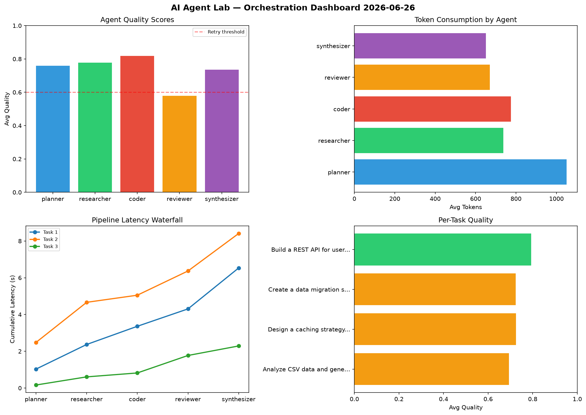

# AI Agent Lab — Orchestration Report 2026-06-26

**Run ID:** `af99ac1e07` | **Tasks:** 4 | **Avg Quality:** 0.734

## Aggregate Metrics

| Metric | Value |
|--------|-------|
| avg_latency | 6.101 |
| total_tokens | 15534 |
| avg_quality | 0.734 |

## Delta vs Yesterday

| Metric | Today | Yesterday | Change |
|--------|-------|-----------|--------|
| avg_latency | 6.101 | 5.629 | 📈 8.4% |
| total_tokens | 15534 | 14772 | 📈 5.2% |
| avg_quality | 0.734 | 0.771 | 📉 -4.8% |

## Pipeline Results

### Analyze CSV data and generate statistical summary
| Agent | Quality | Latency | Tokens | Status |
|-------|---------|---------|--------|--------|
| planner | 0.615 | 1.031s | 735 | success |
| researcher | 0.86 | 1.339s | 879 | success |
| coder | 0.789 | 0.99s | 706 | success |
| reviewer | 0.51 | 0.946s | 818 | needs_retry |
| synthesizer | 0.694 | 2.227s | 647 | success |

### Design a caching strategy for high-traffic endpoints
| Agent | Quality | Latency | Tokens | Status |
|-------|---------|---------|--------|--------|
| planner | 0.918 | 2.481s | 986 | success |
| researcher | 0.549 | 2.183s | 870 | needs_retry |
| coder | 0.859 | 0.387s | 712 | success |
| reviewer | 0.527 | 1.318s | 752 | needs_retry |
| synthesizer | 0.771 | 2.039s | 848 | success |

### Create a data migration script for schema v2
| Agent | Quality | Latency | Tokens | Status |
|-------|---------|---------|--------|--------|
| planner | 0.782 | 0.165s | 1259 | success |
| researcher | 0.824 | 0.443s | 615 | success |
| coder | 0.838 | 0.213s | 718 | success |
| reviewer | 0.653 | 0.951s | 571 | success |
| synthesizer | 0.525 | 0.518s | 551 | needs_retry |

### Build a REST API for user authentication
| Agent | Quality | Latency | Tokens | Status |
|-------|---------|---------|--------|--------|
| planner | 0.722 | 0.324s | 1223 | success |
| researcher | 0.88 | 2.174s | 585 | success |
| coder | 0.786 | 0.186s | 961 | success |
| reviewer | 0.624 | 2.402s | 541 | success |
| synthesizer | 0.955 | 2.088s | 557 | success |
