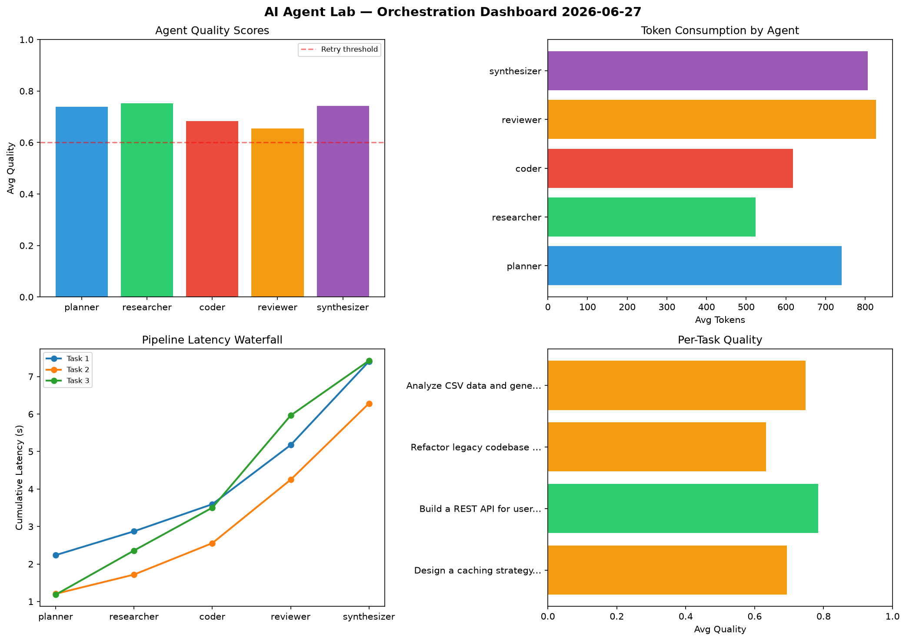

# AI Agent Lab — Orchestration Report 2026-06-27

**Run ID:** `f6fcb0321b` | **Tasks:** 4 | **Avg Quality:** 0.714

## Aggregate Metrics

| Metric | Value |
|--------|-------|
| avg_latency | 6.981 |
| total_tokens | 14059 |
| avg_quality | 0.714 |

## Delta vs Yesterday

| Metric | Today | Yesterday | Change |
|--------|-------|-----------|--------|
| avg_latency | 6.981 | 6.101 | 📈 14.4% |
| total_tokens | 14059 | 15534 | 📉 -9.5% |
| avg_quality | 0.714 | 0.734 | 📉 -2.7% |

## Pipeline Results

### Design a caching strategy for high-traffic endpoints
| Agent | Quality | Latency | Tokens | Status |
|-------|---------|---------|--------|--------|
| planner | 0.716 | 2.237s | 561 | success |
| researcher | 0.724 | 0.635s | 441 | success |
| coder | 0.525 | 0.723s | 329 | needs_retry |
| reviewer | 0.875 | 1.578s | 864 | success |
| synthesizer | 0.623 | 2.23s | 1054 | success |

### Build a REST API for user authentication
| Agent | Quality | Latency | Tokens | Status |
|-------|---------|---------|--------|--------|
| planner | 0.995 | 1.205s | 575 | success |
| researcher | 0.875 | 0.513s | 424 | success |
| coder | 0.701 | 0.838s | 814 | success |
| reviewer | 0.637 | 1.692s | 1017 | success |
| synthesizer | 0.712 | 2.035s | 851 | success |

### Refactor legacy codebase to use dependency injection
| Agent | Quality | Latency | Tokens | Status |
|-------|---------|---------|--------|--------|
| planner | 0.676 | 1.182s | 801 | success |
| researcher | 0.51 | 1.177s | 662 | needs_retry |
| coder | 0.524 | 1.143s | 903 | needs_retry |
| reviewer | 0.566 | 2.459s | 1186 | needs_retry |
| synthesizer | 0.891 | 1.462s | 378 | success |

### Analyze CSV data and generate statistical summary
| Agent | Quality | Latency | Tokens | Status |
|-------|---------|---------|--------|--------|
| planner | 0.57 | 1.373s | 1024 | needs_retry |
| researcher | 0.902 | 1.442s | 566 | success |
| coder | 0.983 | 1.225s | 424 | success |
| reviewer | 0.539 | 1.386s | 243 | needs_retry |
| synthesizer | 0.746 | 1.389s | 942 | success |
